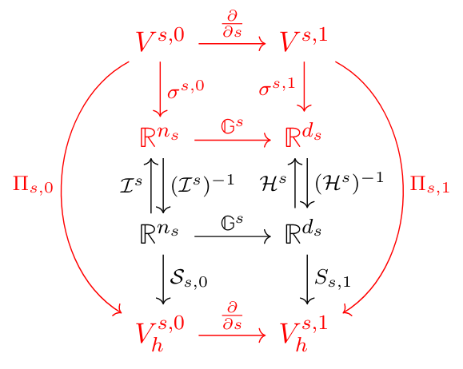
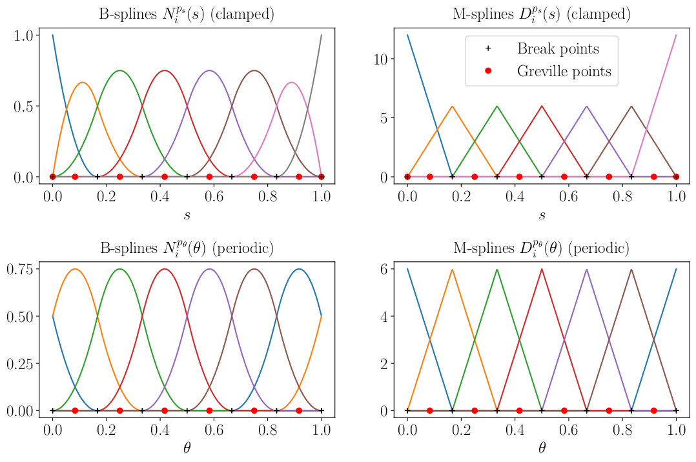

.. _derham:

Discrete De Rham complex
------------------------

Uni-variate FEEC spaces
^^^^^^^^^^^^^^^^^^^^^^^

Finite element spaces in :abbr:`STRUPHY (STRUcture-Preserving HYbrid codes)` are based on uni-variate B-spline spaces.
The following diagram shows on the bottom line the two univariate spaces :math:`V_h^{s,0}` and :math:`V_h^{s,1}` 
that are linked by the derivatve operator:

The spaces :math:`V_h^{s,0}` and :math:`V_h^{s,1}` will be called the *0-space* and the *1-space*, respectively.
They are spanned by B-spline basis functions of different (polynomial) degree, such that the image of the derivative
acting on the 0-space (degree *p*) is contained in the 1-space (degree *p-1*). This is one of the main features needed for building
discrete differential forms (FEEC - Finite Element Exterior Calculus) in multiple dimensions. Here, *s* denotes a non-periodic coordinate;
we shall also make use of periodic spaces :math:`V_h^{\theta,0}` and :math:`V_h^{\theta,1}`, where :math:`\theta` stands for a periodic (angle-like)
coordinate. 

The upper-most row of the diagram contains the continuous function spaces :math:`V^{s,0} = H^1(\Omega_s)`
and :math:`V^{s,1} = L^2(\Omega_s)` with :math:`\Omega_s=[0,1]`. The *degrees of freedom* (DOFs) 
:math:`\sigma^{s,0}: V^{s,0} \to \mathbb C^{n_s}` and :math:`\sigma^{s,1}: V^{s,1} \to \mathbb C^{d_s}`
are linear functionals on the continuous spaces, with their image in the second row.
The third row contains spaces for the *finite element (FE) coefficients* in the respective spline basis.
An important feature of FEEC are the *commuting projectors*, denoted by :math:`\Pi_{s,0}` and :math:`\Pi_{s,1}` and discussed below.

We shall discuss the periodic (':math:`\theta`') and non-periodic ('*s*') uni-variate spaces 
:math:`V_h^{0}` and :math:`V_h^{1}` in more detail. 
Let :math:`\Omega_s = \Omega_\theta = [0, 1]` with partitions defined by :math:`0 = s_0 < s_1 \ldots < s_{n_s-p_s} = 1`
and :math:`0 = \theta_0 < \theta_1 \ldots < \theta_{n_\theta} = 1` such that the number of cells (or elements) 
is :math:`n_s - p_s` and :math:`n_\theta`, respectively. 
Uni-variate B-spline bases of degree :math:`p_s\geq 1` and :math:`p_\theta \geq 1` are defined via the knot sequences

    .. math::
        T_s &:= ( \underbrace{0, \ldots, 0}_{p_s\ \text{times}}, s_0, s_1, \ldots, s_{n_s-p_s-1}, s_{n_s-p_s}, \underbrace{1, \ldots, 1}_{p_s\ \text{times}})\,,
        
        T_\theta &:= ( \underbrace{\theta_{-p_\theta}, \ldots, \theta_{-1}}_{p_\theta\ \text{points}}, \theta_0, \theta_1, \ldots,\theta_{n_\theta-1}, \theta_{n_\theta}, \underbrace{\theta_{n_\theta + 1}, \ldots, \theta_{n_\theta + p_\theta}}_{p_\theta\ \text{points}})\,.

We construct *clamped* B-splines in :math:`\Omega_s` and periodic B-splines in :math:`\Omega_\theta`.
In the periodic case we have :math:`\theta_{-i} = \theta_{n_\theta - i} - 1` and :math:`\theta_{n_\theta + i} = \theta_{i} + 1`
for :math:`i\in\{1,\ldots,p_\theta\}` and the multiplicity of each knot is 1. 
The knot sequence :math:`T_\theta` containing :math:`n_\theta + 2 p_\theta + 1` distinct cell interfaces yields :math:`n_\theta + p_\theta`
shifted B-splines of identical shape that are :math:`\mathcal{C}^{p_\theta-1}` everywhere. 
The last :math:`p_\theta` B-splines are identified with the first :math:`:math:`p_\theta` B-splines to ensure periodicity.
This yields the final number of :math:`n_\theta` linearly independent periodic B-spline basis functions in :math:`\Omega_\theta`,
denoted by :math:`N^{p_\theta}_i(\theta)` with :math:`i\in\{0,\ldots, n_\theta -1\}`. 
In the clamped case the knot sequence :math:`T_s` with :math:`n_s + p_s + 1` points yields
:math:`n_s` B-splines, where all, except for the first and the last B-spline, are :math:`\mathcal{C}^{p_s-1}` everywhere. 
Hence we obtain :math:`n_s` linearly independent clamped B-spline basis functions in :math:`\Omega_s`, denoted by :math:`N^{p_s}_i(s)` with :math:`i\in\{0,\ldots, n_s -1\}`. 
Since the first and the last knot have multiplicity :math:`p_s+1`, the first and the last B-spline are 
interpolatory at :math:`s=0` and :math:`s=1`, respectively:

    .. math::
        N^{p_s}_{0}(0)=N^{p_s}_{n_s-1}(1)=1\,,\qquad N^{p_s}_{i>0}(0)=N^{p_s}_{i<n_s-1}(1)= 0\,.

This allows for an efficient construction of spaces by simply removing contributions 
from the last spline :math:`N^{p_s}_{n_s-1}(s)`.  
The derivatives of B-splines :math:`N^{p_s}_i(s)` and :math:`N^{p_\theta}_i(\theta)` can be expressed as 

    .. math:: 
        &\frac{\text{d}}{\text{d}s}{N^{p_s}_i}(s) 
        = p_s \left( \frac{N^{p_s-1}_i(s)}{T_{s,i+p_s}-T_{s,i}} - \frac{N^{p_s-1}_{i+1}(s)}{T_{s,i+p_s+1}-T_{s,i+1}}  \right)\,,\quad N^{p_s-1}_0(s)=N^{p_s-1}_{n_s}(s)=0\,,
        
        &\frac{\text{d}}{\text{d}\theta}{N^{p_\theta}_i}(\theta) 
        = p_\theta \left( \frac{N^{p_\theta-1}_i(\theta)}{T_{\theta,i+p_\theta}-T_{\theta,i}} - \frac{N^{p_\theta-1}_{i+1}(\theta)}{T_{\theta,i+p_\theta+1}-T_{\theta,i+1}}  \right)\,,\quad N^{p_\theta-1}_0(\theta)=N^{p_\theta-1}_{n_\theta}(\theta)\,,
        
where :math:`N^{p_s-1}_i(s)` and :math:`N^{p_\theta-1}_i(\theta)` are lower degree B-splines created from
the same knot sequences above. It is convenient to define the lower degree, re-scaled B-splines (also called M-splines)

    .. math::
        D_{i}^{p_s}(s) := p_s\, \frac{N^{p_s-1}_{i+1}(s)}{T_{s,i+p_s+1}-T_{s
        ,i+1}}\,,\qquad
        D_{i}^{p_\theta}(\theta) := p_\theta\, \frac{N^{p_\theta-1}_{i+1}(\theta)}{T_{\theta,i+p_\theta+1}-T_{\theta
        ,i+1}}\,,

where :math:`i \in \{0,\ldots,d_s - 1\}` with :math:`d_s=n_s-1` for :math:`D_{i}^{p_s}(s)`.
In the periodic case the last :math:`p_\theta-1` M-splines that have a non-vanishing support in :math:`\Omega_\theta`
are once more identified with the first :math:`p_\theta-1` M-splines. This yields the total number of
:math:`d_\theta=n_\theta` linearly independent periodic M-splines. The recursion formulae for the derivatives become

    .. math::
        &\frac{\text{d}}{\text{d}s}{N^{p_s}_i}(s) = D^{p_s}_{i-1}(s) - D^{p_s}_{i}(s)\,,\qquad &&D_{-1}^{p_s}(s)=D_{n_s-1}^{p_s}(s)=0\,,
        
        &\frac{\text{d}}{\text{d}\theta}{N^{p_\theta}_i}(\theta) = D^{p_\theta}_{i-1}(\theta) - D^{p_\theta}_{i}(\theta)\,,\qquad &&D_{-1}^{p_\theta}(\theta)=D_{n_\theta-1}^{p_\theta}(\theta)\,.

Finally, we define the so-called Greville points, denoted by :math:`(\mathfrak{s}_i)_{i=0}^{n_s-1}` and :math:`(\mathfrak{t}_i)_{i=0}^{n_\theta-1}`:

    .. math::
        \mathfrak{s}_i:=\frac{1}{p_s}\sum_{j=i+1}^{i+p_s}T_{s,j}\,,\qquad\quad \mathfrak{t}_i:=\frac{1}{p_\theta}\sum_{j=i+1}^{i+p_\theta}T_{\theta,j}\,.

These points will serve as interpolation points in Section \ref{sec:projectors} when projection operators 
on B-spline spaces based on interpolation and histopolation are introduced. 
A Greville point is generally located close the maximum of the B-spline with the same index. 
Typical examples of uni-variate B-spline bases are plotted in the following figure
for the clamped (top left) and the periodic (bottom left) case. 
The corresponding lower degree, re-scaled B-splines (here called M-splines) are plotted in the right column.
The splines are created from equally spaced cell interfaces (here called break points) 
and the Greville points are shown as well (red dots).

Based on the introduced uni-variate B-spline bases in both directions :math:`s` and :math:`\theta`, 
we define the following function spaces:

    .. math::
        V^{s,0}_h &:= \left\{ f(s) = \sum_{i=0}^{n_s-1} f_i N^{p_s}_i(s)\,,\quad f_i \in \mathbb C \right\}\,,\qquad &&\text{dim}\,V^{s,0}_h = n_s\,,
        
        V^{s,1}_h &:= \left\{ f(s) = \sum_{i=0}^{d_s-1} f_i D^{p_s}_i(s)\,,\quad f_i \in \mathbb C \right\}\,,\qquad &&\text{dim}\,V^{s,1}_h = d_s = n_s - 1\,,
        
        V^{\theta,0}_h &:= \left\{ g(\theta) = \sum_{i=0}^{n_\theta-1} g_i N^{p_\theta}_i(\theta)\,,\quad g_i \in \mathbb C \right\}\,,\qquad &&\text{dim}\,V^{\theta,0}_h = n_\theta\,,
        
        V^{\theta,1}_h &:= \left\{ g(\theta) = \sum_{i=0}^{d_\theta-1} g_i D^{p_\theta}_i(\theta)\,,\quad g_i \in \mathbb C \right\}\,,\qquad &&\text{dim}\,V^{\theta,1}_h = d_\theta = n_\theta\,.

For :math:`f_h \in V^{s,0}_h` and :math:`g_h \in V^{\theta,0}_h` we have for the derivatives, 

    .. math::
        f_h' = \sum_{i=0}^{n_s-1} f_i ( D^{p_s}_{i-1} - D^{p_s}_i ) = \sum_{i=0}^{d_s-1} ( f_{i+1} - f_i) D^{p_s}_i \quad \in V^{s,1}_h \,,
        \
        g_h' = \sum_{i=0}^{n_\theta-1} g_i ( D^{p_\theta}_{i-1} - D^{p_\theta}_i ) = \sum_{i=0}^{d_\theta-1} ( g_{i+1} - g_i) D^{p_\theta}_i \quad \in V^{\theta,1}_h \,.\label{ders_t}

Hence, we can define the derivative matrices :math:`\mathbb G^s \in \mathbb R^{d_s \times n_s}` and
:math:`\mathbb G^\theta \in \mathbb R^{d_\theta \times n_\theta}` with entries

    .. math::
        \mathbb G^s_{ij} := \begin{cases}
        -1 & \text{for}\quad j=i \,, 
        \\
        1 & \text{for}\quad j=i+1 \,,
        \\
        0 & \text{else}\,,
        \end{cases}
        \qquad \qquad \mathbb G^\theta_{ij} := \begin{cases}
        -1 & \text{for}\quad j=i \,, 
        \\
        1 & \text{for}\quad j= \text{mod}(i+1, n_\theta)\,, 
        \\
        0 & \text{else} \,,
        \end{cases}

respectively. By additionally stacking FE coefficients and basis functions on top of each other (bold symbols),

    .. math::
        &\mathbf f := (f_i)_{i=0}^{n_s-1}\,,     \qquad &&\mathbf N^s := (N^{p_s}_i)_{i=0}^{n_s-1}\,,\qquad                &&\mathbf D^s := (D^{p_s}_i)_{i=0}^{d_s-1}\,, 
        
        &\mathbf g := (g_i)_{i=0}^{n_\theta-1}\,,\qquad &&\mathbf N^\theta := (N^{p_\theta}_i)_{i=0}^{n_\theta-1}\,,\qquad &&\mathbf D^\theta := (D^{p_\theta}_i)_{i=0}^{d_\theta-1}\,,
 
functions :math:`f_h \in V^{s,0}_h` and :math:`g_h \in V^{\theta,0}_h` and their derivatives :math:`f_h' \in V^{s,1}_h` and :math:`g_h' \in V^{\theta,1}_h` can compactly be written as
    .. math::
        &f_h(s) = \mathbf f^\top \mathbf N^s(s)\,,     \qquad\qquad &&f_h'(s) = (\mathbb G^s\, \mathbf f)^\top \mathbf D^s(s)\,, 
        
        &g_h(\theta) = \mathbf g^\top \mathbf N^\theta(\theta)\,,\qquad\qquad &&g_h'(\theta) = (\mathbb G^\theta\, \mathbf g)^\top \mathbf D^\theta(\theta)\,.

Commuting projectors are defined by inter-/histopolation. The degrees of freedom (DOFs) can be defined as

    .. math::
        &f \in V^{s,0}:\qquad&&\boldsymbol{\sigma}^{s,0}:=(\sigma_i^{s,0})_{i=0}^{n_s-1}\,, \qquad &&\sigma_i^{s,0}(f) := f(\mathfrak{s}_i)\,,
        
        &g \in V^{s,1}:\qquad&&\boldsymbol{\sigma}^{s,1}:=(\sigma_i^{s,1})_{i=0}^{d_s-1}\,, \qquad &&\sigma_i^{s,1}(g) := \int_{\mathfrak{s}_i}^{\mathfrak{s}_{i+1}}g(s)\,\textnormal d s\,.  

Here, :math:`\mathfrak{s}=(\mathfrak{s}_i)_{i=0}^{n_s-1}` are the interpolation points in :math:`\Omega_s`, for example
the Greville points of a spline basis, and :math:`d_s=n_s-1` is the number of histopolation intervals. 
The bases of the FE spaces :math:`V^{s,0}_h` and :math:`V^{s,1}_h` appear in the inter-/histopolation matrices

    .. math::
        \mathcal I^s_{ij} := N^{p_s}_j(\mathfrak{s}_i) \,,\qquad \mathcal H^s_{ij} := \int_{\mathfrak{s}_i}^{\mathfrak{s}_{i+1}} D^{p_s}_j(s)\,\textnormal d s\,,

respectively. The interpolation points :math:`\mathfrak{s}` have to be chosen such that :math:`\mathcal I^s` 
and :math:`\mathcal H^s` are invertible (that is the reason for Greville points with splines, usually). 
When using for instance a quadrature rule of sufficient order for computing integrals,
the matrix :math:`\mathcal H^s` is exact since M-splines are piece-wise polynomials. 

The operators :math:`\mathcal{S}_{s,0}: \mathbb C^{n_s} \to V^{s,0}_h` and
:math:`\mathcal{S}_{s,1}: \mathbb C^{d_s} \to V^{s,1}_h` map FE coefficients to the corresponding spline function:

    .. math::
        V^{s,0}_h \ni f_h &= S_{s,0}[\mathbf{f}](s) = \sum_{j=0}^{n_s-1} f_j\,N^{p_s}_j(s)\,, \qquad &&\mathbf{f} = (f_j)_{j=0}^{n_s-1}\,,
        
        V^{s,1}_h \ni g_h &= S_{s,1}[\mathbf{g}](s) = \sum_{j=0}^{d_s-1} g_j\,D^{p_s}_j(s)\qquad &&\mathbf{g} = (g_j)_{j=0}^{d_s-1}\,.

For the DOFs this means

    .. math::
        \sigma^{s,0}_i(f_h) &= \sum_{j=0}^{n_s-1} f_j\,N^{p_s}_j(\mathfrak{s}_i) = \sum_j \mathcal I^s_{ij}\, f_j \quad&&\Rightarrow\quad\sigma^{s,0}(f_h)=\mathcal{I}^s\,\mathbf{f}\,,
        
        \sigma^{s,1}_i(g_h) &= \sum_{j=0}^{d_s-1} g_j \int_{\mathfrak{s}_i}^{\mathfrak{s}_{i+1}}D^{p_s}_j(s)\,\textnormal d s = \sum_j \mathcal H^s_{ij}\, g_j \quad&&\Rightarrow\quad\sigma^{s,1}(g_h)=\mathcal{H}^s\,\mathbf{g}\,,

such that it is evident that the DOFs \eqref{DOFs} uniquely define an element
in :math:`V^{s,0}_h` and :math:`V^{s,1}_h` provided that :math:`\mathcal I^s` and :math:`\mathcal H^s` are invertible.
 
The projectors :math:`\Pi_{s,0}: V^{s,0} \to V^{s,0}_h` and :math:`\Pi_{s,1}: V^{s,1} \to V^{s,1}_h` are defined via the DOFs:

    .. math::
        \sigma^{s,0}(\Pi_{s,0}(f)) = \sigma^{s,0}(f)\,,\qquad \sigma^{s,1}(\Pi_{s,1}(g)) = \sigma^{s,1}(g)\,,

and hence involve the inversion of the collocation/histopolation matrix :math:`\mathcal I^s`/:math:`\mathcal H^s`. 
The same consideration hold also for the periodic spaces.

In :abbr:`STRUPHY (STRUcture-Preserving HYbrid codes)` the uni-variate spaces are constructed with the class

.. autoclass:: struphy.feec.spline_space.Spline_space_1d
   :members: 
   :undoc-members:

Tensor_spline_space class
^^^^^^^^^^^^^^^^^^^^^^^^^

In :abbr:`STRUPHY (STRUcture-Preserving HYbrid codes)` all 3D spline spaces are built on the unit cube (*logical domain*)
:math:`\hat \Omega = [0,1]^3` with logical coordinates :math:`\boldsymbol \eta = (\eta_1, \eta_2,\eta_3) \in \hat \Omega`.
The de Rham diagram looks like this:

.. image:: ../pics/deRham_diag.png

Symbols with an overbar refer to the :ref:`polar_splines` basis. In :abbr:`STRUPHY (STRUcture-Preserving HYbrid codes)`
the above diagram is handled within the *Tensor_spline_space class*. This class includes important
methods (described below) such as

    * ``assemble_Mn``, where ``n from {0, 1, 2, 3, v}``, for the assembly of mass matrices
    * ``evaluate_AB``, where ``A, B from {N, D}``, for the evaluation of 2DxFourier basis splines
    * ``evaluate_ABC``, where ``A, B, C from {N, D}``, for the evaluation of 3D basis splines
    * ``extract_n``, where ``n from {0, 1, 2, 3, v}``, for reshaping flattened FE coefficients into 3D arrays
    * ``set_projectors``, for enabling commuting projectors

The entry in ``parameters.yml`` to initialize the Tensor_spline_space class can be found in :ref:`params_grid`.

.. autoclass:: struphy.feec.spline_space.Tensor_spline_space
   :members: 
   :undoc-members:

Discrete derivatives
^^^^^^^^^^^^^^^^^^^^

.. automodule:: struphy.feec.derivatives.derivatives
   :members: 
   :undoc-members:

Mass matrices
^^^^^^^^^^^^^

.. automodule:: struphy.feec.basics.mass_matrices_1d
   :members: 
   :undoc-members:

.. automodule:: struphy.feec.basics.mass_matrices_2d
   :members: 
   :undoc-members:

.. automodule:: struphy.feec.basics.mass_matrices_3d
    :members: 
    :undoc-members:

Pre-conditioners
^^^^^^^^^^^^^^^^

.. automodule:: struphy.feec.basics.mass_matrices_3d_pre
    :members: 
    :undoc-members:

Commuting projectors
^^^^^^^^^^^^^^^^^^^^

Global projectors
"""""""""""""""""

.. automodule:: struphy.feec.projectors.pro_global.projectors_global
    :members: 
    :undoc-members:

Local projectors (quasi-interpolation)
""""""""""""""""""""""""""""""""""""""

.. automodule:: struphy.feec.projectors.pro_local.projectors_local
    :members: 
    :undoc-members:

.. _polar_splines:

Polar splines
^^^^^^^^^^^^^

.. automodule:: struphy.geometry.polar_splines
    :members: 
    :undoc-members: