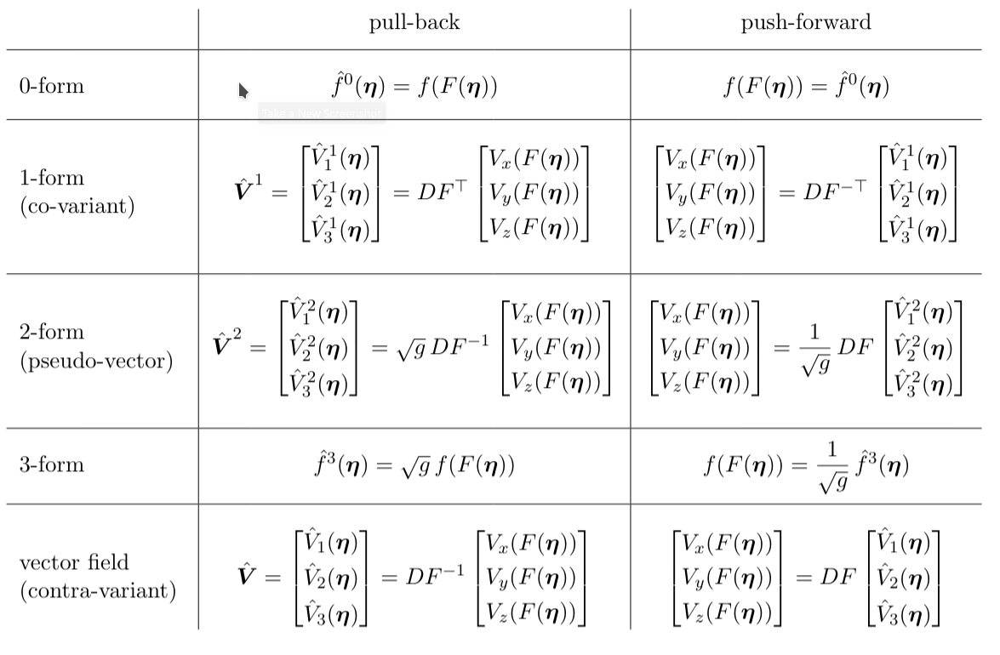

.. _developers:

Developer's guide
=================

.. _repo:

Git repository
--------------

The Struphy repo is on `gitlab.mpcdf.mpg.de <https://gitlab.mpcdf.mpg.de/clapp/hylife>`_.

You need a developer to grant access.

.. _adding_code:

Shared development
------------------

.. _workflow:

Workflow 
^^^^^^^^

When adding code to Struphy it is important that other developers can follow what you are planning/doing.
For this we use the ``Issue`` tracker on the left panel of the `repo webpage <https://gitlab.mpcdf.mpg.de/clapp/hylife>`_.

If you plan to add a small feature (finished in a couple of days):

1. Create an ``Issue`` by clicking on the blue button ``New issue`` in the top-right corner.
2. Insert informative title and description. 
3. Assign to yourself.
4. Select a corresponding Milestone if the issue fits.
5. [Optional: select a due date.]
6. Click ``Create Issue``.

If you have a bigger code change in mind that might take several days or weeks:

1. Click ``New milestone`` in ``Issues/Milestone`` from the left panel.
2. Insert informative title and description (point by point).
3. [Optional: select a due date.]
4. Click ``Create milestone``.
5. Add issues that correspond to your milestone (see above).

.. note::

    Create :ref:`feature_branches` to work an an issue or a group of issues. **Delete** the feature branch after the merge request.
    Do not keep a feature branch too long (usually a couple of days, 1-2 weeks max). 

**Closing an issue**: mention the issue via its link (bottom of the right side panel of the issue's page) in the corresponding 
:ref:`merge request <merge_requests>`, then close the issue.

.. _main_branches:

Main branches 
^^^^^^^^^^^^^

There are two main branches, ``master`` and ``devel``. Nobody can push directly to these branches. 
The master branch holds the current release of the code. 
``devel`` is the main branch for developers. The code in ``devel`` can be modified via :ref:`feature_branches`.

.. _feature_branches:

Feature branches 
^^^^^^^^^^^^^^^^

When implementing changes to ``devel`` you must do this via a **feature branch** in the following way::

    git checkout devel
    git checkout -b feature

This creates locally on your machine the new feature branch `feature` and checks it out.
Work on your new feature and commit changes in a timely manner::

    git commit -m 'I made this and that.'

You can make as many commits as you like in your feature branch.

From time to time, it is important to check whether the main branch has changed
(make sure your working directory is clean for this, e.g. with ``git stash``)::

    git fetch
    git checkout devel
    git status

In case the main branch has changed you must perform either :ref:`rebasing` or :ref:`merging` (see `here <https://www.atlassian.com/de/git/tutorials/merging-vs-rebasing>`_ for a comparison of the two concepts). 
Merging must be done instead of rebasing if

1. Your branch is published (pushed to origin)
2. Your branch is not yet merged with main
3. The main branch has changed since your feature creation or last rebase

**The golden rule of rebasing: only rebase a private branch!** This means you rebase **before** publishing your feature branch to the repository.

When you are done coding the new feature, create a new remote branch and push your changes::

    git push -u origin feature

You can continue working locally on your feature, then use ``git push`` to update the new remote branch.

.. _merge_requests:

Merge requests 
^^^^^^^^^^^^^^

Once you are done working on the new feature, you must create a **merge request** (called pull request on Github). 
There are several ways to do this, one of which is as follows: 

    1. On the gitlab webpage go to "Merge requests" on the left panel of the page. 
    2. Choose ``feature`` as the **source branch** and ``devel`` as the **target branch**.
    3. Select either *Stefan Possanner* or *Florian Holderied* as **Assignee**.
    4. Check both boxes ``delete source branch`` and ``sqash commits``.
    5. Click "Create merge request".

Once the merge is accepted your code is merged into ``devel``, 
the remote feature branch gets deleted and the commits are squashed.

In order to mention the merge request in issues/comments, go to its page and copy/paste the link under ``Reference:`` from the right panel.

.. _rebasing:

Rebasing
^^^^^^^^

In a team of multiple developers it often happens that the main branch ``devel`` changes while
you are working on your feature branch. In other words, **main and feature branches have diverged**. 

In this case it is advised to **rebase your feature branch** as follows
(make sure your working directory is clean for this, e.g. with ``git stash``)::

    git checkout devel
    git pull
    git checkout feature
    git rebase devel

This will add your ``feature`` commits on top of the main branch's current state.

**The golden rule of rebasing: only rebase a private branch!** 
This means you rebase **before** publishing your feature branch to the repository.

**Merge conflicts** have to be resolved manually.
``git rebase`` will let you resolve merge conflicts one-by-one for each of your feature branch commits
(which are placed on top of the diverged state of ``devel`` with ``rebase``).

``git status`` will show which files have to be looked at ("both modified").

[Visual Studio Code](https://code.visualstudio.com/) provides a very useful interface for resolving merge conflicts. When opening a file "both modified" you will see something like this:

.. image:: ../pics/vscode_rebase.png

**HEAD (current state)** is the ``devel`` branch (!) in green, and blue is from your feature commit. 
The merge conflict is resolved by clicking either "Accept Current Change" (``devel``) or "Accept Incoming Change" (``feature``).
You have to do this for each conflict in the file (indicated by a blue region in the rightmost scrolling bar), and for each file "both modified".

Save the changes in the files.

``git add`` the modified files.

``git rebase --continue`` will move you forward to the next commit to be added on top of ``devel``. 
If no files have to be changed you can move forward with ``git rebase --skip``.

In case that you made an error during the rebase process you can always go back to your local state with ``git rebase --abort``.

.. _merging:

Merging
^^^^^^^

Merging must be done instead of rebasing if

1. Your branch is published (pushed to origin)
2. Your branch is not yet merged with main
3. The main branch has changed since your feature creation or last rebase

Merging is easy::

    git checkout devel
    git pull
    git checkout feature
    git merge devel

Merging will create a meaningless merge commit in your ``git log``. 

.. _ci:

Continuous integration 
^^^^^^^^^^^^^^^^^^^^^^

`Continuous integration (CI) <https://gitlab.mpcdf.mpg.de/help/ci/index.md>`_ stands for the automatic building and testing of the code.
On gitlab this is done through the ``.gitlab-ci.yml`` file in the repository (see `quickstart ci guide <https://gitlab.mpcdf.mpg.de/help/ci/quick_start/index.md>`_).

In Struphy, there are two ways of testing code:

1. **Unit tests**: test small units of ``Python`` code (functions, modules).
2. **Code tests**: runs a complete code via ``struphy run`` on only a few points in space-time.

The **unit tests** have to be added in the folder ``struphy/tests``. The files therein have to start with ``test_`` 
and contain ONLY functions that also start with ``test_``. In this way they are recognized by ``pytest`` in ``.gitlab-ci.yml``:

.. literalinclude:: ../../.gitlab-ci.yml
    :language: yaml
    :lineno-start: 258
    :lines: 258-258

The **code tests** must be added directly in ``.gitlab-ci.yml``:

.. literalinclude:: ../../.gitlab-ci.yml
    :language: yaml
    :lineno-start: 273
    :lines: 273-277

There are pre-defined parameter files starting with ``params_ci_`` available for code tests (you can add to these if necessary). 

.. _change_doc:

Changing the documentation 
--------------------------

The source files (``.rst``) for the documentation are in ``/doc/sections`` in the repository. 
If you make changes to these files, you can review them in your browser (e.g. firefox)::

    cd doc
    make html
    firefox _build/html/index.html

When making further changes, just do ``make html`` and refresh the window in your browser.

.. note::

    In Struphy, it is mandatory to include **latex math formulas** using the ``.. math::`` environment in docstrings of

        - :ref:`models`
        - :ref:`propagators`
        - :ref:`domains`
        - :ref:`backgrounds`
        - :ref:`dispersions`
        - :ref:`pushers`
        - :ref:`accumulators`
        - :ref:`mhd_ops`

    This will automatically keep the documentation up-to-date.

.. _add_model:

Adding models 
-------------

.. _model_requirements:

Requirements
^^^^^^^^^^^^

Struphy can accommodate only models that satisfy the following criteria:

* 3d in space
* Initial-boundary value problem or eigenvalue problem
* Smooth solutions
* Field variables depending on :math:`(\mathbf x,t)` are discretized within the :ref:`3d_derham_complex`
* (Gyro-)kinetic variables depending in :math:`(\mathbf x, \mathbf v,t)` are discretized with a particle method
* Single patch mapping (see :ref:`add_mapping`)

The time stepping scheme can be composed of several well-defined **propagators**.
Assuming our model features the unknowns :math:`vars(t^n)` at time :math:`t^n`, the overall propagator
can be denoted as :math:`\Phi_{\Delta t}[vars(t^n)] = vars(t^n + \Delta t)`.
Struphy can handle models where :math:`\Phi_{\Delta t}` is decomposed (or split):  

.. math::
    \Phi_{\Delta t}[vars(t^n)] = \Phi^1_{\Delta t}[\textnormal{subset1}(vars(t^n))] \circ \Phi^2_{\Delta t}[\textnormal{subset2}(vars(t^n))] \circ ...

with sub steps :math:`\Phi^1_{\Delta t}`, :math:`\Phi^2_{\Delta t}`, etc. that update a subset of (or all) :math:`vars(t^n)`. 
More refined splitting schemes than Lie-Trotter are available in Struphy.

.. (see ``struphy/models/codes/exec.py`` lines 186-209):

.. .. literalinclude:: ../../struphy/models/codes/exec.py
..     :language: python
..     :linenos: 
..     :lineno-start: 186
..     :lines: 186-209

.. _to_do_list_model:

Quickguide for adding a Struphy model
^^^^^^^^^^^^^^^^^^^^^^^^^^^^^^^^^^^^^

1. Add a new class inheriting the :ref:`model_base_class` to the module ``struphy/models/codes/models.py``. Use existing classes as templates.
2. Check the list of already existing

    a. :ref:`propagators`
    b. :ref:`accumulators`
    c. :ref:`pushers`
    
Use those directly in case they fit your model. 

3. If non-exisitng, add your model's propagators based on the :ref:`prop_base_class` to the module ``struphy/models/codes/propagators.py``. The name must start with ``Step``. Use existing classes as templates.  
4. If needed, add new parameters to the default input file ``struphy/io/inp/parameters.yml``.
5. Add a new if-clause for your model in ``exec.py`` after line 81. The string given in ``code==<your_model_name>`` should match exactly the name of the new model class from 1.::

    if code=='Maxwell':
        MODEL = models.Maxwell(DR, DOMAIN, params['solvers']['pcg_1'])
    else:
        raise NotImplementedError(f'Model {code} not implemented.')
        exit()

6. Re-install Struphy, compile and run your model via the command line: ``struphy run <your_model_name>``.
7. Optional: add a description of your model in

    a. the help function of ``scripts/struphy``
    b. the doc under ``doc/section/models.rst``

.. _model_base_class:

StruphyModel base class
^^^^^^^^^^^^^^^^^^^^^^^

Implemented models that inherit the base class are listed in :ref:`models`. 

.. autoclass:: struphy.models.base.StruphyModel
    :members:
    :undoc-members:

.. _model_example:

Model example: ``Maxwell``
^^^^^^^^^^^^^^^^^^^^^^^^^^

Let us look at the example of the model ``Maxwell`` (:ref:`models`). 
The model has two field variables (FE coefficients) :math:`\mathbf e \in \mathbb R^{N_1}` and :math:`\mathbf b \in \mathbb R^{N_2}` that 
are updated with a single propagator (see :ref:`propagator_example`) derived from a Crank-Nicolson discretization:

    .. math::
        \begin{bmatrix}
        \mathbf e^{n+1} - \mathbf e^n \\[2mm] \mathbf b^{n+1} - \mathbf b^n
       \end{bmatrix} = 
       \frac{\Delta t}{2} 
       \begin{bmatrix}
        0 & \mathbb{M}_1^{-1}\mathbb{C}^\top 
        \\[2mm] 
        - \mathbb{C}\mathbb{M}_1^{-1}  & 0
       \end{bmatrix}
       \begin{bmatrix}
        \mathbb{M}_1 (\mathbf e^{n+1} + \mathbf e^n) \\[2mm] \mathbb M^2 (\mathbf b^{n+1} + \mathbf b^n)
       \end{bmatrix} \,.

.. literalinclude:: ../../struphy/models/codes/models.py
    :language: python
    :linenos: 
    :lineno-start: 189
    :lines: 189-258

Let us go through the code one-by-one. First, we note that the docstring contains the model equations 
and their normalization (in latex format). This is necessary for the correct documentation of the model.

The class ``Maxwell`` inherits all members of the base class via

.. literalinclude:: ../../struphy/models/codes/models.py
    :language: python
    :linenos: 
    :lineno-start: 189
    :lines: 189

As we can see, the abstract properties ``propagators``, ``scalar_quantities`` as well as the abstract method  
``update_scalar_quantities`` from the base class ``StruphyModel`` have been implemented in the subclass ``Maxwell``.
Otherwise, an error message would occur.

The ``__init__`` function is called from the base class via ``super()``.
The field variables of the model are specified as in ``e_field='Hcurl'``, where the keyword ``e_field`` 
is the name of the variable used for saving and the value ``'Hcurl'`` is the space of the variable 
(can also be ``'H1'``, ``'Hdiv'``, ``'L2'`` or ``'H1^3'``).

Mass matrices have to be assembled model-specific. In this case we only need :math:`\mathbb M_1` and :math:`\mathbb M_2`:
The actual ``Stencil-/BlockVectors`` holding the FE coefficients have been created by ``super().__init__``
and can be retrieved from the ``fields`` property defined in the base class ``StruphyModel``.

The lists ``self._propagators`` and ``self._scalar_quantities`` returned by the abstract properties
have to be filled with model specific propagator objects 
(just one in the case of ``Maxwell``) and scalar quantities of interest.

.. _prop_base_class:

Propagator base class
^^^^^^^^^^^^^^^^^^^^^^

Implemented propagators that inherit the base class are listed in :ref:`propagators`. 

.. autoclass:: struphy.propagators.base.Propagator
    :members:
    :undioc-members:

.. _propagator_example:

Propagator example: ``StepMaxwell``
^^^^^^^^^^^^^^^^^^^^^^^^^^^^^^^^^^^

The one propagator used in the model ``Maxwell`` is listed in :ref:`propagators` and called ``StepMaxwell``:

.. literalinclude:: ../../struphy/models/codes/propagators.py
    :language: python
    :linenos: 
    :lineno-start: 89
    :lines: 89-164

Let us go through the propagator's source one-by-one. First, we note that the docstring contains the 
propagator equations (in latex format). This is necessary for the correct documentation of the propagator.

The ``__init__`` call is model-specific (not done by the base class).
The present propagator needs a :ref:`preconditioner`, one 2x2 block matrix and a :ref:`schur_solver`

The definition of the abstract property ``variables`` is a must in each propagator.
It returns a list of the variables updated by the propagator.

Finally, also the abstract method ``push`` must be defined in each propagator.
It only takes the time step ``dt`` as argument and updates the variables specified in ``self.variables``.
Note that the function ``self.in_place_update``  from the base class ``Propagators`` can be used 
to perform the in-place update of the variables.

.. _add_mapping:

Adding mapped domains 
---------------------

Implemented mappings are listed in :ref:`domains`. 

In :abbr:`STRUPHY (STRUcture-Preserving HYbrid codes)` equations are discretized on the unit cube (*logical domain*)
:math:`\hat \Omega = [0,1]^3` with logical coordinates :math:`\boldsymbol \eta = (\eta_1, \eta_2,\eta_3) \in \hat \Omega`. 
The *physical domain* :math:`\Omega \subset \mathbb R^3` is the image of :math:`\hat\Omega` under the mapping

   .. math::
      F:\hat{\Omega}\rightarrow\Omega,\,\,(\eta_1, \eta_2,\eta_3) = \boldsymbol \eta \mapsto \mathbf x =  (x, y, z) = F(\eta_1, \eta_2,\eta_3).

Hence, :math:`\mathbf{x} := (x, y, z)` are global or "Cartesian" coordinates of :math:`\Omega` and
:math:`\mathbf \eta` are local, curvilinear coordinates of :math:`\Omega`.
The map *F* is assumed to be :math:`\mathcal{C}^1` everywhere except at one polar point (which can be treated with :ref:`polar_splines`).
The Jacobian matrix, its determinant and the metric tensor are denoted by

   .. math::
      DF_{i,j} = \frac{\partial F_i}{\partial \eta_j}\,,\qquad \sqrt g := |\det(DF)|\,,\qquad G := DF^\top DF\,.

The mapping *F* and corresponding metric coefficients are handled via the *Domain class* in :abbr:`STRUPHY (STRUcture-Preserving HYbrid codes)`.
This class has four important methods (described below):

   - ``evaluate`` for evaluation of metric coefficients
   - ``pull`` for the pullback of p-forms 
   - ``push`` for the pushforward of p-forms
   - ``transform`` for the transformation between p-forms

Summary of pull-back and push-forward transformations between generic scalar and vector-valued functions
:math:`f=f(\mathbf{x})` and :math:`\mathbf{V}=[V_x(\mathbf{x}),V_y(\mathbf{x}),V_z(\mathbf{x})]`, respectively, 
and differential *k*-forms (:math:`0\leq k\leq 3`) under the map :math:`F:\hat{\Omega}\rightarrow\Omega,\,\,\boldsymbol{\eta}\mapsto\mathbf{x}=F(\boldsymbol{\eta})`.

The list of availabe mapppings in :abbr:`STRUPHY (STRUcture-Preserving HYbrid codes)` can be read from the Notes below.

.. _add_equil:

Adding static backgrounds
-------------------------

Implemented backgrounds listed in :ref:`backgrounds`. 

.. _add_dispersion:

Adding dispersion relations 
---------------------------

Implemented dispersion relations that inherit the base class are listed in :ref:`dispersions`. 

.. autoclass:: struphy.dispersion_relations.base.DispersionRelations1D

As an example, consider the dispersion relation for light waves in vacuum:

.. literalinclude:: ../../struphy/models/dispersion_relations/analytic.py
    :language: python
    :linenos: 
    :lineno-start: 65
    :lines: 65-88  

The new class inherits the base class in

.. literalinclude:: ../../struphy/models/dispersion_relations/analytic.py
    :language: python
    :linenos: 
    :lineno-start: 65
    :lines: 65

The ``__init__`` is done via the base class by calling ``super()``. One has to provide a name for each branch of the spectrum (here just the ``light wave``) and all parameters necessary for
computing the dispersion relation (here just the speed of light ``c``, which is 1 in Struphy normalization, see :ref:`models`).

The abstract method ``spectrum`` must be defined; the only really model-specific part is the definition 
of the computation of each branch. Here, there is just one branch, namely the light wave in vacuum which propagates at the speed ``c``.

.. _add_pusher:

Adding particle pushers 
-----------------------

.. _add_accum:

Adding PIC accumulation routines 
--------------------------------

Implemented accumulation functions are listed in :ref:`accumulators`. 

.. autoclass:: struphy.pic.particles_to_grid.Accumulator

.. autofunction:: struphy.pic.accum_kernels._docstring

.. _add_weighted_mass:

Adding weighted mass matrices 
-----------------------------

.. automodule:: struphy.psydac_api.mass_psydac
    :members:

.. _add_mhd_ops:

Adding MHD operators 
--------------------

Implemented MHD operators are listed in :ref:`mhd_ops`.

