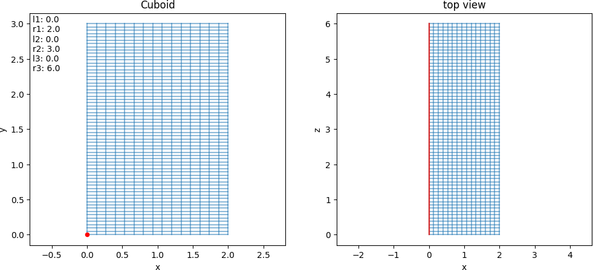
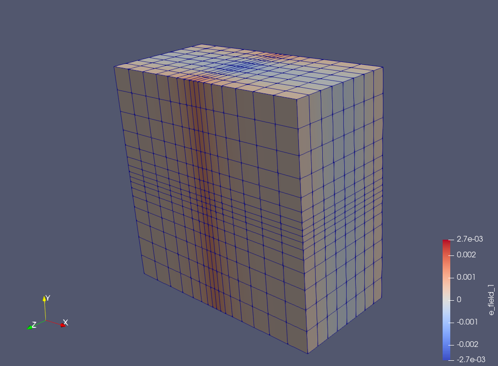

.. _domains:

Mapped domains
===============

List of currently available mappings

* :ref:`cuboid`
* :ref:`orthogonal`

.. _cuboid:

Slab
----

.. math::
    F = \,,
    
Example with paramters :math:`\alpha`

.. _orthogonal:

Stretched slab
--------------

.. math::
    F = \,,
    
Example with paramters :math:`\alpha`

