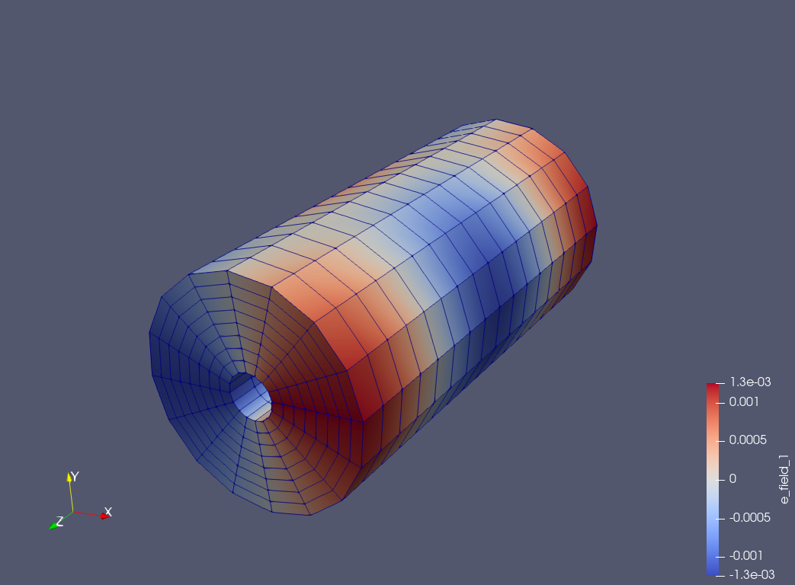
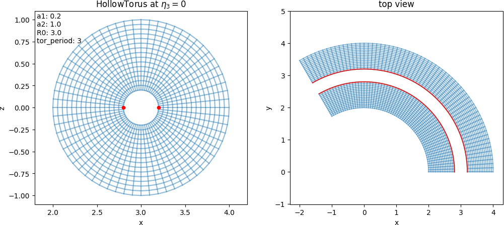
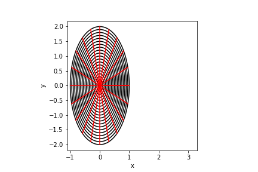
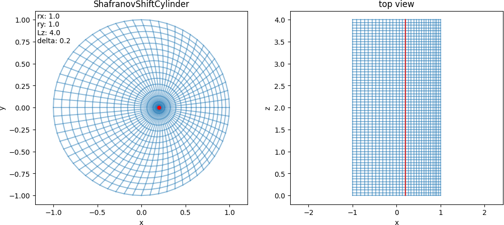
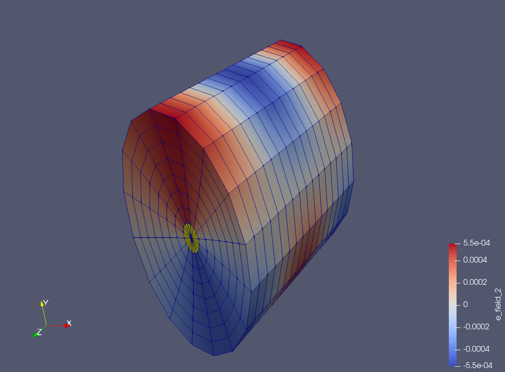

.. _domains:

Mapped domains
===============

List of currently available mappings

* :ref:`cuboid`
* :ref:`orthogonal`
* :ref:`colella`
* :ref:`hollowcylinder`
* :ref:`hollowtorus`
* :ref:`ellipse`
* :ref:`shafranovshift`
* :ref:`shafranovdshaped`

.. _cuboid:

Slab
----

.. math::
    x &= l_1 + (r_1 - l_1)\,\eta_1\,, \\
    y &= l_2 + (r_2 - l_2)\,\eta_2\,, \\
    z &= l_3 + (r_3 - l_3)\,\eta_3\,.
    
Example with paramters :math:`l_1=0\,,r_1=1\,,l_2=0\,,r_2=1\,,l_3=0` and :math:`r_3=1`:

.. image:: ../pics/mappings/cuboid.png

.. _orthogonal:

Non-uniform slab
----------------

.. math::
    x &= L_x\,\left[\,\eta_1 + \alpha\sin(2\pi\,\eta_1)\,\right]\,, \\
    y &= L_y\,\left[\,\eta_2 + \alpha\sin(2\pi\,\eta_2)\,\right]\,, \\
    z &= L_z\,\eta_3\,.
    
Example with paramters :math:`L_x=1\,,L_y=1\,,\alpha=0.1` and :math:`L_z=1`:

.. image:: ../pics/mappings/orthogonal.png

.. _colella:

Colella
-------

.. math::
    x &= L_x\,\left[\,\eta_1 + \alpha\sin(2\pi\,\eta_1)\sin(2\pi\,\eta_2)\,\right]\,, \\
    y &= L_y\,\left[\,\eta_2 + \alpha\sin(2\pi\,\eta_2)\sin(2\pi\,\eta_1)\,\right]\,, \\
    z &= L_z\,\eta_3\,.
    
Example with paramters :math:`L_x=1\,,L_y=1\,,\alpha=0.1` and :math:`L_z=1`:

.. image:: ../pics/mappings/colella.png

.. _hollowcylinder:

Hollow cylinder
---------------

.. math::
    x &= \left[\,a_1 + (a_2-a_1)\,\eta_1\,\right]\cos(2\pi\,\eta_2)+R_0\,, \\
    y &= \left[\,a_1 + (a_2-a_1)\,\eta_1\,\right]\sin(2\pi\,\eta_2)\,, \\
    z &= 2\pi R_0\,\eta_3\,.
    
Example with paramters :math:`a_1=0.2\,,a_2=1` and :math:`R_0=3`:

.. _hollowtorus:

Hollow torus
------------

.. math::
    x &= \lbrace\left[\,a_1 + (a_2-a_1)\,\eta_1\,\right]\cos(2\pi\,\eta_2)+R_0\rbrace\cos(2\pi\,\eta_3)\,, \\
    y &=  \,\,\,\left[\,a_1 + (a_2-a_1)\,\eta_1\,\right]\sin(2\pi\,\eta_2)\,, \\
    z &= \lbrace\left[\,a_1 + (a_2-a_1)\,\eta_1\,\right]\cos(2\pi\,\eta_2)+R_0\rbrace\sin(2\pi\,\eta_3)\,.
    
Example with paramters :math:`a_1=0.2\,,a_2=1` and :math:`R_0=3`:

.. _ellipse:

Ellipse
-------

.. math::
    x &= x_0+r_x\,\eta_1\cos(2\pi\,\eta_2)\,, \\
    y &= y_0+r_y\,\eta_1\sin(2\pi\,\eta_2)\,, \\
    z &= z_0+L_z\,\eta_3\,.
    
Example with paramters :math:`x_0=y_0=z_0=0\,,r_x=1\,,r_y=2` and :math:`L_z=1`:

.. _shafranovshift:

Shafranov shift
---------------

.. math::
    x &= x_0+r_x\,\eta_1\cos(2\pi\,\eta_2)+(1-\eta_1^2)r_x\Delta\,, \\
    y &= y_0+r_y\,\eta_1\sin(2\pi\,\eta_2)\,, \\
    z &= z_0+L_z\,\eta_3\,.
    
Example with paramters :math:`x_0=y_0=z_0=0\,,r_x=1\,,r_y=1\,,L_z=1` and :math:`\Delta=0.2`:

.. _shafranovdshaped:

Shafranov D-shaped
------------------

.. math::
    x &= x_0+R_0\left[1 + (1 - \eta_1^2)\Delta_x + \eta_1\epsilon\cos(2\pi\,\eta_2 + \arcsin(\delta)\eta_1\sin(2\pi\,\eta_2)) \right]\,, \\
    y &= y_0+R_0\left[    (1 - \eta_1^2)\Delta_y + \eta_1\epsilon\kappa\sin(2\pi\,\eta_2)\right]\,, \\
    z &= z_0+L_z\,\eta_3\,.
    
Example with paramters :math:`x_0=y_0=z_0=0\,,R_0=3\,,L_z=1\,,\Delta_x=0.1\,,\Delta_y=0\,,\delta=0.2\,,\epsilon=1/3` and :math:`\kappa=1.5`:

