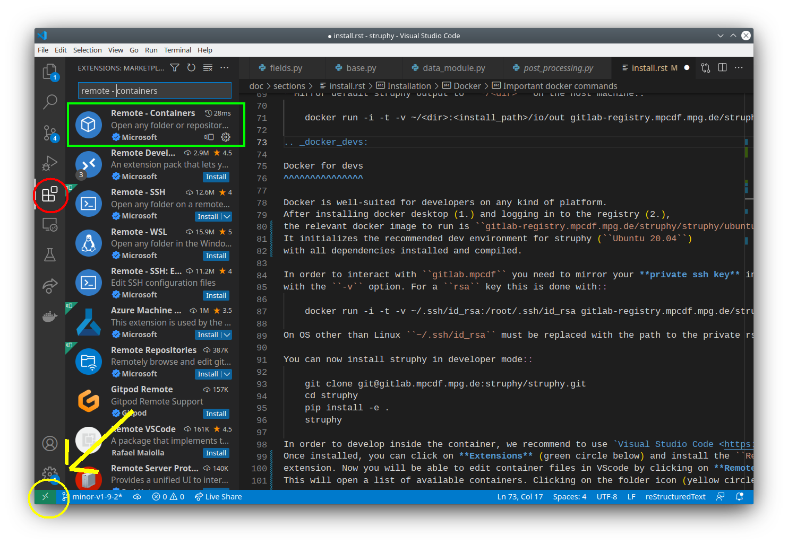

.. _install:

Install
=======

.. _require:

Prerequisites
-------------

**Basics:** 

- Python >=3.10 
- C or Fortran compiler like gcc, gfortran
- Linear algebra packages BLAS and LAPACK

**For parallel runs:**

- An MPI library like open-mpi, mpich
- OpenMP

**Interfaces to physics codes:**

- Check the requirements for `GVEC <https://gvec.readthedocs.io/v1.0/user/install.html#prerequisites>`_.

Virtual environment
-------------------

In order to not interfere with existing Python packages, 
it is highly recommended to install Struphy in a `virtual environment <https://pypi.org/project/virtualenv/>`_::

    python -m pip install -U virtualenv

Then::

    python -m venv struphy_env
    source struphy_env/bin/activate
    pip install -U pip

.. _install_modes:

Install and compile
-------------------

.. tab-set::

    .. tab-item:: base install

        .. code-block::

            pip install -U struphy
            struphy compile --status
            struphy compile
            struphy -h

    .. tab-item:: more Physics

        .. code-block::

            pip install -U struphy[phys]
            struphy compile --status
            struphy compile
            struphy -h

    .. tab-item:: with MPI

        .. code-block::

            pip install -U struphy[mpi]
            struphy compile --status
            struphy compile
            struphy -h

    .. tab-item:: for developers

        .. code-block::

            git clone git@github.com:struphy-hub/struphy.git
            cd struphy
            pip install -e .[dev,doc]
            struphy compile --status
            struphy compile
            struphy -h

    .. tab-item:: all options

        .. code-block::

            git clone git@github.com:struphy-hub/struphy.git
            cd struphy
            pip install -e .[all]
            struphy compile --status
            struphy compile
            struphy -h

In case you encounter problems during install visit :ref:`trouble_shoot`.

.. _sample_envs:

Sample environments
-------------------

Some Linux environments on which Struphy is continuously tested are:

.. tab-set::

    .. tab-item:: Ubuntu

        .. code-block::

            apt install -y software-properties-common
            add-apt-repository -y ppa:deadsnakes/ppa
            apt update -y
            apt install -y python3-pip 
            apt install -y python3-venv 
            apt install -y gfortran gcc 
            apt install -y liblapack-dev libopenmpi-dev 
            apt install -y libblas-dev openmpi-bin 
            apt install -y libomp-dev libomp5 
            apt install -y git
            apt install -y pandoc

    .. tab-item:: OpenSuse

        .. code-block::

            zypper refresh
            zypper install -y python311 python311-devel
            zypper install -y python311-pip python3-virtualenv
            zypper install -y gcc-fortran gcc 
            zypper install -y lapack-devel openmpi-devel 
            zypper install -y blas-devel openmpi 
            zypper install -y libgomp1 
            zypper install -y git 
            zypper install -y pandoc 
            zypper install -y vim 
            zypper install -y make

    .. tab-item:: AlmaLinux

        .. code-block::

            - yum install -y wget yum-utils make openssl-devel bzip2-devel libffi-devel zlib-devel
            - yum update -y 
            - yum clean all 
            - yum install -y gcc 
            - yum install -y gfortran  
            - yum install -y openmpi openmpi-devel  
            - yum install -y libgomp 
            - yum install -y git 
            - yum install -y environment-modules 
            - yum install -y sqlite-devel
            - wget https://www.python.org/ftp/python/3.10.14/Python-3.10.14.tgz 
            - tar xzf Python-3.10.14.tgz 
            - cd Python-3.10.14 
            - ./configure --with-system-ffi --with-computed-gotos --enable-loadable-sqlite-extensions 
            - make -j ${nproc} 
            - make altinstall 
            - cd ..
            - export PATH="/usr/lib64/openmpi/bin:$PATH"
            - mv /usr/local/lib/libpython3.10.a libpython3.10.a.bak

    .. tab-item:: Fedora-CentOS-RHEL

        .. code-block::

            dnf install -y wget yum-utils make openssl-devel bzip2-devel libffi-devel zlib-devel
            dnf update -y  
            dnf install -y gcc
            dnf install -y gfortran  
            dnf install -y blas-devel lapack-devel  
            dnf install -y openmpi openmpi-devel 
            dnf install -y libgomp 
            dnf install -y git 
            dnf install -y environment-modules 
            dnf install -y python3-mpi4py-openmpi 
            dnf install -y pandoc
            dnf install -y sqlite-devel
            wget https://www.python.org/ftp/python/3.10.14/Python-3.10.14.tgz 
            tar xzf Python-3.10.14.tgz 
            cd Python-3.10.14 
            ./configure --with-system-ffi --with-computed-gotos --enable-loadable-sqlite-extensions 
            make -j ${nproc} 
            make altinstall 
            cd .. 
            mv /usr/local/lib/libpython3.10.a libpython3.10.a.bak
            module load mpi/openmpi-$(arch)

    .. tab-item:: MacOS

        .. code-block::

            brew update
            brew install python3
            brew install gcc
            brew install openblas
            brew install lapack
            brew install open-mpi
            brew install libomp
            brew install git
            brew install pandoc

On **Windows systems** we recommend the use of a virtual machine, for instance the :ref:`multipass`.

.. _trouble_shoot:

Trouble shooting
----------------

Install problems
^^^^^^^^^^^^^^^^

* Make sure that you can ``pip install -U mpi4py``.
* `mpi4py>=4.1.0 provides binaries <https://github.com/mpi4py/mpi4py/releases/tag/4.1.0>`_ for common platforms. In case of "exotic" platforms you might try ``pip install -U mpi4py --no-binary mpi4py``
* In many cases installing ``apt install openmpi-devel`` solves a problem with missing headers.
* On Mac OS, you can try to install the command line tools (160 MB) ``xcode-select --install``.
* Struphy is not supported with Conda; however, in case you insist you might try::

    conda install mpich
    conda install gxx_linux-64

Compilation problems
^^^^^^^^^^^^^^^^^^^^

* If compilation fails, ``struphy compile --delete`` can help to clean up the environment.
* 
  It can happen that during ``struphy compile`` you encounter::

    A module that was compiled using NumPy 1.x cannot be run in
    NumPy 2.2.1 as it may crash. To support both 1.x and 2.x
    versions of NumPy, modules must be compiled with NumPy 2.0.
    Some module may need to rebuild instead e.g. with 'pybind11>=2.12'.

  At the moment this error is resolved with::

    pip install numpy==1.26.4

.. _args:

Argument completion
-------------------

Struphy provides console argument completion through the package `argcomplete <https://github.com/kislyuk/argcomplete>`_.
In order to enable it, make sure to have `bash <https://www.cyberciti.biz/faq/add-bash-auto-completion-in-ubuntu-linux/>`_ 
or `zsh <https://dev.to/zeromeroz/setting-up-zsh-and-oh-my-zhs-with-autocomplete-plugins-1nml>`_ tab comlpetion enabled. 
After Struphy installation type::

    activate-global-python-argcomplete

and follow the instructions. For activation you need to restart your shell, for instance with ``exec bash``.

.. _docker_install:

Docker
------

You can run Struphy in a `docker container <https://www.docker.com/resources/what-container/>`_, 
encapsulated from your host machine.
The container is launched from an `image <https://docs.docker.com/get-started/overview/#docker-objects>`_ 
which you can download and run immediately, irrespective of your architecture and OS.

`Struphy's Github package registry <https://github.com/orgs/struphy-hub/packages>`_

.. _user_install:

User install
^^^^^^^^^^^^

To use Struphy via docker, perform the following steps:

1. `Install Docker Desktop <https://docs.docker.com/desktop/>`_ and start it. 

.. tab-set::

    .. tab-item:: Linux

        If you do not want to preface the docker command with ``sudo``, you can 
        `create a Unix group <https://docs.docker.com/engine/install/linux-postinstall/>`_ 
        called ``docker`` and add your user to it.
        If you are uncomfortable with running `sudo`, you can `run docker in "rootless" mode <https://docs.docker.com/engine/security/rootless/>`_.

    .. tab-item:: MacOS

        It is recommended to read the `Mac OS permission requirements <https://docs.docker.com/desktop/mac/permission-requirements/>`_.
        (REMARK: older versions of Mac OS may require `older docker desktop versions <https://docs.docker.com/desktop/release-notes/#docker-desktop-471>`_.)

    .. tab-item:: Windows

        It is recommended to read the `Windows permission requirements <https://docs.docker.com/desktop/windows/permission-requirements/>`_

2. Pull one of the availabale images listed above (< 1 GB in size), for instance::

    docker pull ghcr.io/struphy-hub/struphy/ubuntu-with-reqs:latest

3. Run the container::

    docker run -it ghcr.io/struphy-hub/struphy/ubuntu-with-reqs:latest

The option ``-i`` stands for interactive while ``-t`` gives you a terminal.

4. Install Struphy.

Important docker commands
^^^^^^^^^^^^^^^^^^^^^^^^^

* ``docker images`` shows the images available on your computer.
* ``docker run -d -t --name <container_name> IMAGE`` runs the container in the background (detached).
* ``docker exec <container_name> COMMAND`` gives a bash command to a detached container.
* ``docker stop <container_name>`` stops the container.
* ``docker ps -l`` lists all containers (also exited/stopped).
* ``docker restart <container_name>`` restarts the container in detached mode.
* ``docker attach <container_name>`` opens a terminal to a detached container.

* Mirror default Struphy output to ``~/<dir>`` on the host machine::
    
    docker run -it -v ~/<dir>:<install_path>/io/out gitlab-registry.mpcdf.mpg.de/struphy/struphy/release

.. _docker_devs:

Docker for devs
^^^^^^^^^^^^^^^

Docker is well-suited for developers on any kind of platform. 
In order to interact with Github you need to mirror your **private ssh key** into the container 
with the ``-v`` option. For a ``rsa`` key this is done with::

    docker run -it -v ~/.ssh/id_rsa:/root/.ssh/id_rsa ghcr.io/struphy-hub/struphy/ubuntu-with-reqs:latest

On OS other than Linux ``~/.ssh/id_rsa`` must be replaced with the path to the private rsa key.

You can now install Struphy from source (see above). An installation in **editable mode** (``pip install -e .``) can only be done
within a virtual environment.

In order to develop inside the container, we recommend to use `Visual Studio Code <https://code.visualstudio.com/>`_.
Once installed, you can click on **Extensions** (red circle below) and install the ``Dev Containers``
extension (green box). Now you will be able to edit container files in VScode by clicking on the green symbol
in the bottom-left corner (yellow circle). Choose ``Attach to a running container ...`` and select 
the container in which you want to edit. By doing ``File - Open Folder...`` you are able to
open any folder from the container.

We recommend to install the following VScode extensions inside the container:

- ``Python`` extension 
- ``Python Extensions`` extension
- ``Jupyter`` extension  

MPCDF computing clusters
------------------------

Struphy is periodically tested on the `MPCDF HPC facilities <https://docs.mpcdf.mpg.de/doc/computing/index.html>`_.
Tests are performed with the `available MPCDF images <https://docs.mpcdf.mpg.de/doc/data/gitlab/gitlabrunners.html#docker-images-for-ci-with-mpcdf-environment-modules>`_.
The modules loaded in these tests can be found in Struphy's `.gitlab-ci.yml <https://gitlab.mpcdf.mpg.de/struphy/struphy/-/blob/devel/.gitlab-ci.yml?ref_type=heads#L82>`_.

A common installation looks like this

1. Load necessary modules and create a virtual environment::

    module purge
    module load gcc/14 openmpi/5.0 python-waterboa/2024.06 git pandoc graphviz/8
    pip install -U virtualenv
    python3 -m venv <some_name>
    source <some_name>/bin/activate
    python3 -m pip install --upgrade pip

2. Install Struphy by not using the binaries of `mpi4py` (see install methods from above: :ref:`pypi_install` or :ref:`source_install`):

    pip install -U struphy --no-binary mpi4py

3. When using slurm, include the following lines in your BATCH script::

    source <some_name>/bin/activate

    OMPI_MCA_mpi_warn_on_fork=0
    export OMPI_MCA_mpi_warn_on_fork  