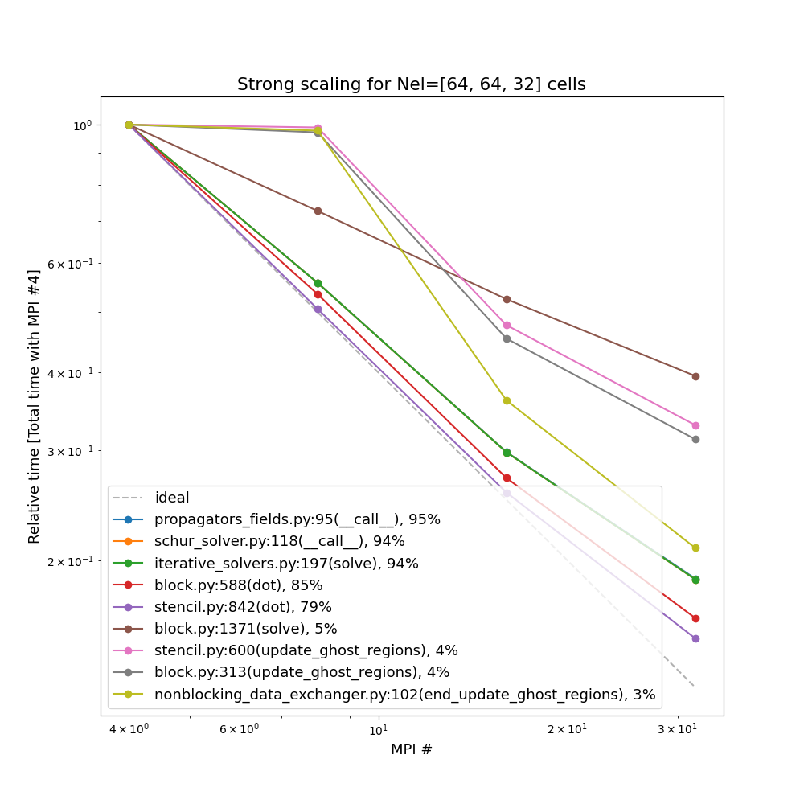
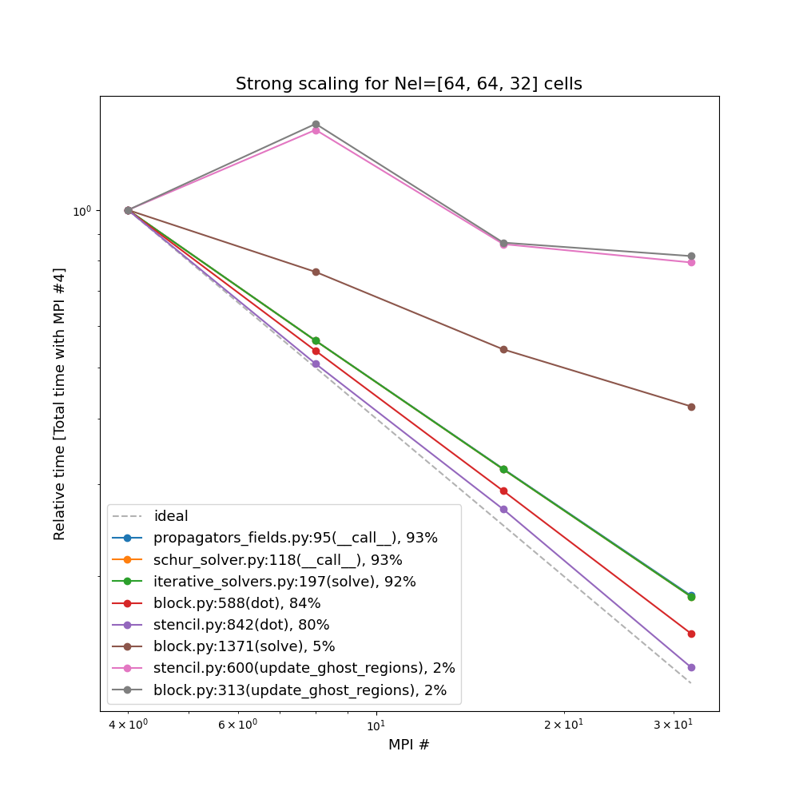
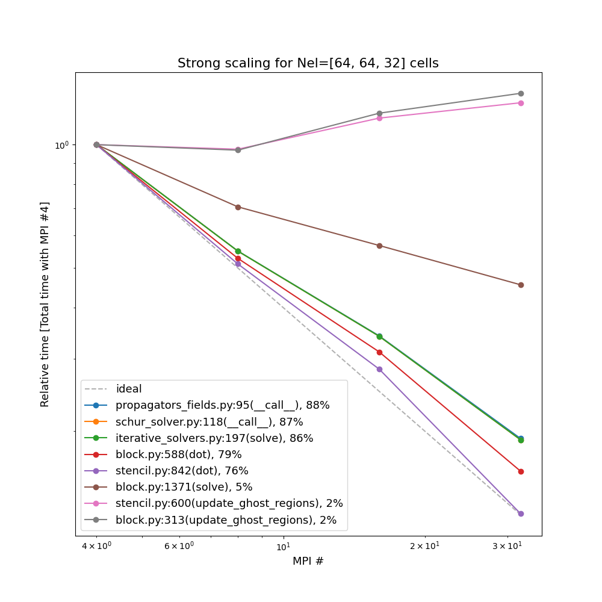
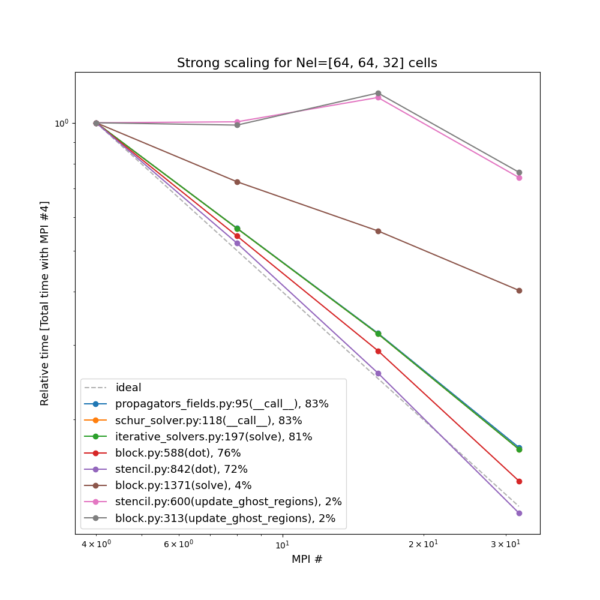

.. _performance_tests:

Performance tests
===============

Scaling test: Maxwell
--------------------------------------------
The results from the scaling test of the model **Maxwell** (see ``Maxwell`` in :ref:`models`) with **MPCDF_cobra**.
The Maxwell equations are solved at different domains, **Cuboid**, **Colella** and **HollowTorus** (see :ref:`avail_mappings`).
At each domains, two different initialization, **Noise** and **ModesSin** (see :ref:`avail_inits`), are tested.
Each of exactly same problems is solved with different numbers of processes (4, 8, 16, 32). 

Used parameters and batch files are available at (https://gitlab.mpcdf.mpg.de/struphy/struphy-simulations/-/tree/main/mpcdf_cobra_scaling/Maxwell).

1. **Cuboid**

- **Noise**
    .. image:: ../pics/performance_tests/maxwell/cuboid.png
        :width: 700
        :align: center

- **ModesSin**
    .. image:: ../pics/performance_tests/maxwell/cuboid_sin.png
        :width: 700
        :align: center

2. **Colella**

- **Noise**

- **ModesSin**

3. **HollowTorus**

- **Noise**

- **ModesSin**
