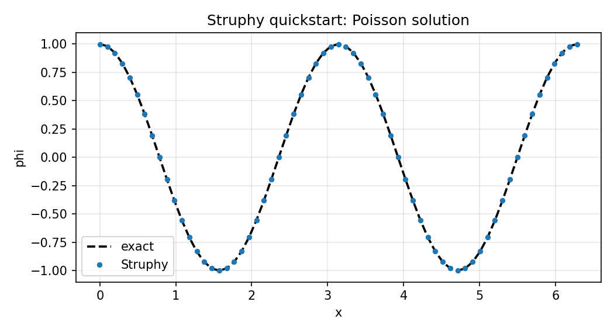

.. _quickstart:

Quickstart
==========

Struphy is a Python API for solving PDEs with structure-preserving discretizations.
This quickstart shows how to solve a simple problem with minimal input: a 1D Poisson solve.

For interactive tutorials (no local install), use `mybinder <https://mybinder.org/v2/gh/struphy-hub/struphy-tutorials/main>`_.
For more examples, see :ref:`userguide` and the :ref:`tutorial collection <tutorials>`.

Solve Poisson In A Few Steps
----------------------------

Make sure that Struphy is installed and compiled (see :ref:`install_modes`).
Save the code below as ``params_poisson.py``. By default, output is written to
``sim_1/`` in the directory from which you launch the script (change this with
:class:`~struphy.EnvironmentOptions`).

We search for a potential :math:`\phi(x, y)` satisfying the Poisson equation

.. math::

    -\Delta \phi = \rho

for a given source term :math:`\rho(x)` on a doubly periodic 2D domain.

1. Import the API and choose a model.

.. code-block:: python

    import numpy as np
    from matplotlib import pyplot as plt

    from struphy import Simulation, domains, grids, perturbations
    from struphy.models import Poisson

2. Create the :class:`~struphy.models.poisson.Poisson` model.

.. code-block:: python

    model = Poisson()

3. This model features the Propagator :class:`~struphy.propagators.poisson_solve.PoissonSolve` under ``propagators.poisson``. 
For periodic boundary conditions we will stabilize via ``options``.

.. code-block:: python

    stab_eps = 1e-8

    model.propagators.poisson.options = model.propagators.poisson.Options(
        stab_eps=stab_eps,
    )

4. Add a manufactured term :math:`\rho(x) = (k^2 + \epsilon)\cos(kx)` to the ``source`` variable.

.. code-block:: python

    Lx = 2.0 * np.pi
    Ly = 4.0 * np.pi
    mode = 2
    k = mode * 2.0 * np.pi / Lx
    source_amp = k**2 + stab_eps

    fun = perturbations.ModesCos(ls=(mode,), amps=(source_amp,))

    model.em_fields.source.add_perturbation(fun)

5. Build domain and grid, then instantiate a simulation.

.. code-block:: python

    domain = domains.Cuboid(r1=Lx, l2=-Ly / 2, r2=Ly / 2)
    grid = grids.TensorProductGrid(num_elements=(64, 64, 1))

    sim = Simulation(model=model, domain=domain, grid=grid)

6. Run the simulation. ``sim.run()`` returns an :class:`~struphy.Output` object,
   the entry point for all post-processing.

.. code-block:: python

    out = sim.run()

7. Evaluate the potential on a line along :math:`\eta_1` and compare to the exact solution.
   ``out.evaluate()`` takes a ``"species/variable"`` name, evaluates the saved spline
   field on the given logical coordinates, and returns a labeled :class:`xarray.DataArray`.
   Omitted directions (here :math:`\eta_2, \eta_3`) default to the midpoint ``0.5``,
   and ``t=-1`` selects the last saved snapshot. The array also carries the physical
   coordinates ``X, Y, Z`` so that xarray's ``.plot()`` can use either coordinate system.

.. code-block:: python

    fig, axs = plt.subplots(1, 2, figsize=(12, 4))

    eta1 = np.linspace(0, 1, 100)
    phi_1d = out.evaluate("em_fields/phi", eta1=eta1, t=-1)

    x = phi_1d["X"]
    phi_exact = np.cos(k * x)
    phi_exact_logical = np.cos(Lx * k * eta1)

    phi_1d.plot(ax=axs[0], label="Struphy")  # plot along eta1 (default)
    phi_1d.plot(x="X", ax=axs[1], label="Struphy")  # plot along physical X
    axs[0].plot(eta1, phi_exact_logical, "k--", lw=1.8, label="exact")
    axs[1].plot(x, phi_exact, "k--", lw=1.8, label="exact")

    for ax in axs:
        ax.legend()
        ax.grid(alpha=0.3)
    fig.savefig("quickstart_poisson_phi.png", dpi=150)
    plt.show()

    Exact (dashed) and Struphy solutions from Step 7, along :math:`\eta_1` (left) and :math:`x` (right).

8. Evaluate on a 2D logical grid and plot in physical coordinates.

.. code-block:: python

    eta = np.linspace(0, 1, 100)
    phi_2d = out.evaluate("em_fields/phi", eta1=eta, eta2=eta, t=-1)
    phi_2d.plot(x="X", y="Y")
    plt.show()

``out`` can also be created later from the output folder alone, e.g. in a separate
post-processing script, via ``out = Output("sim_1")``; the model, domain and numerical
options are reconstructed from ``run_metadata.json``.

Full script (save as ``params_poisson.py`` and run with ``python params_poisson.py``):

.. code-block:: python

    import numpy as np
    from matplotlib import pyplot as plt

    from struphy import Simulation, domains, grids, perturbations
    from struphy.models import Poisson

    model = Poisson()

    stab_eps = 1e-8

    model.propagators.poisson.options = model.propagators.poisson.Options(
        stab_eps=stab_eps,
    )

    Lx = 2.0 * np.pi
    Ly = 4.0 * np.pi
    mode = 2
    k = mode * 2.0 * np.pi / Lx
    source_amp = k**2 + stab_eps

    fun = perturbations.ModesCos(ls=(mode,), amps=(source_amp,))

    model.em_fields.source.add_perturbation(fun)

    domain = domains.Cuboid(r1=Lx, l2=-Ly / 2, r2=Ly / 2)
    grid = grids.TensorProductGrid(num_elements=(64, 64, 1))

    sim = Simulation(model=model, domain=domain, grid=grid)

    if __name__ == "__main__":
        # sim.run() returns an Output object for post-processing
        out = sim.run()

        # out.evaluate() evaluates a saved field on logical coordinates (eta1, eta2, eta3)
        # and returns a labeled xarray.DataArray; omitted etas default to 0.5,
        # t=-1 selects the last snapshot. Physical coordinates X, Y, Z are attached.
        fig, axs = plt.subplots(1, 2, figsize=(12, 4))

        eta1 = np.linspace(0, 1, 100)
        phi_1d = out.evaluate("em_fields/phi", eta1=eta1, t=-1)

        x = phi_1d["X"]
        phi_exact = np.cos(k * x)
        phi_exact_logical = np.cos(Lx * k * eta1)

        # xarray plotting: along eta1 by default, or along any attached coordinate
        phi_1d.plot(ax=axs[0], label="Struphy")
        phi_1d.plot(x="X", ax=axs[1], label="Struphy")
        axs[0].plot(eta1, phi_exact_logical, "k--", lw=1.8, label="exact")
        axs[1].plot(x, phi_exact, "k--", lw=1.8, label="exact")

        for ax in axs:
            ax.legend()
            ax.grid(alpha=0.3)
        fig.savefig("quickstart_poisson_phi.png", dpi=150)
        plt.show()

        # 2D evaluation on a logical tensor-product grid, plotted in physical coordinates
        eta = np.linspace(0, 1, 100)
        phi_2d = out.evaluate("em_fields/phi", eta1=eta, eta2=eta, t=-1)
        phi_2d.plot(x="X", y="Y")
        plt.show()

Same Workflow For All Models
----------------------------

The same Simulation API is reused across models. For example, replace :class:`~struphy.models.poisson.Poisson` with :class:`~struphy.models.maxwell.Maxwell`:

.. code-block:: python

    from pathlib import Path

    from struphy import EnvironmentOptions, Simulation, perturbations
    from struphy.models import Maxwell

    model = Maxwell()
    model.em_fields.e_field.add_perturbation(
        perturbations.ModesCos(ls=(1,), amps=(1e-2,), comp=1)
    )

    env = EnvironmentOptions(sim_folder="sim_data")
    sim = Simulation(model=model, env=env, params_path=__file__)
    if __name__ == "__main__":
        sim.run()

Check :ref:`models` for more models and their specific options.

Generate A Default Parameter File
---------------------------------

You can generate a ready-to-edit parameter file for any model from the CLI:

.. code-block:: bash

    struphy params Poisson

This writes ``params_Poisson.py`` in your current directory. You can open and edit it, then run with:

.. code-block:: bash

    python params_Poisson.py

As all data structures in Struphy are written for MPI, you can run the same script with ``mpirun`` to use multiple processes:

.. code-block:: bash

    mpirun -n 4 python params_Poisson.py

            
