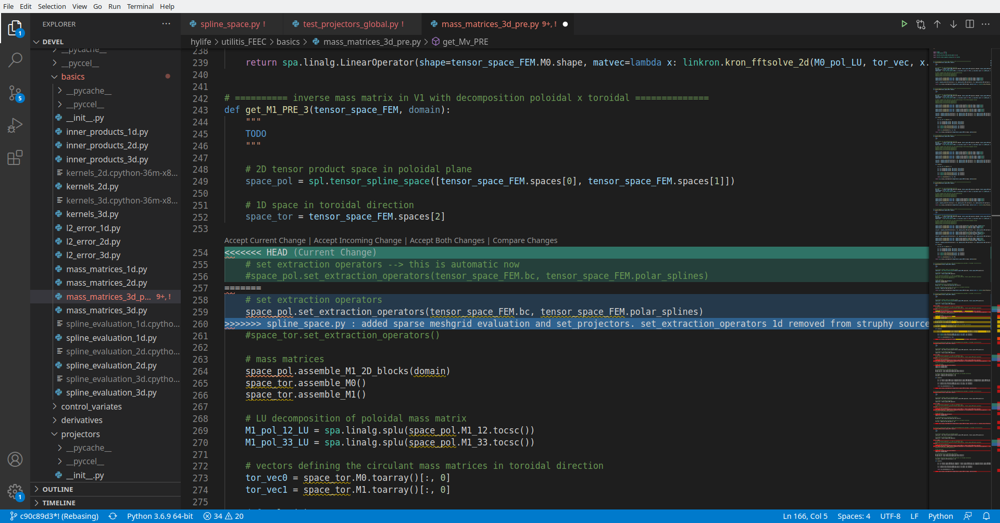

.. _git_workflow:

Git workflow
------------

Main branches 
^^^^^^^^^^^^^

The `Struphy repository <https://gitlab.mpcdf.mpg.de/struphy/struphy/>`_ has two main branches, ``master`` and ``devel``. 
Nobody can push directly to these branches.

The ``master`` branch holds the current release of the code. 

``devel`` is the main branch for developers. :ref:`feature_branches` must be checked out and merged into ``devel``.

.. _open_dev:

Open development
^^^^^^^^^^^^^^^^

When adding code to Struphy it is important that other developers can follow your plans.
For this we use the `Issue tracker <https://gitlab.mpcdf.mpg.de/struphy/struphy/-/issues>`_.
When creating an issue, please use the Struphy issue template and add a short description of your plans.
You can also choose one of the available ``labels`` to make issue processing easier.

For coding, create :ref:`feature_branches` to work an an issue or a group of issues. 

**Do not keep a feature branch too long (!)** (several weeks max).
Otherwise the deviation from ``devel`` will become too large and :ref:`merge_requests` will be increasingly difficult.

It is good practice to junk up a new feature into its "atomic" parts and to keep a log of your work via informative **commit messages**. 

.. _forking:

Forking 
^^^^^^^

In case you are not a `member <https://gitlab.mpcdf.mpg.de/struphy/struphy/-/project_members>`_ of the Struphy project,
you can contribute code by `forking <https://docs.gitlab.com/ee/user/project/repository/forking_workflow.html>`_ the Struphy
repository.

You must create a **public fork** to be able to merge your code into Struphy!

You can create :ref:`feature_branches` in your forked repo and create merge requests into 
the Struphy repo.

`Update your fork <https://docs.gitlab.com/ee/user/project/repository/forking_workflow.html#from-the-command-line>`_
in case ``devel`` changes in the Struphy repo while you are working on your feature.

.. _feature_branches:

Feature branches 
^^^^^^^^^^^^^^^^

When implementing changes to ``devel`` (can be in your fork) you must do this via a **feature branch** in the following way::

    git checkout devel
    git checkout -b <feature>

This creates locally on your machine the new feature branch `<feature>` and checks it out.
Work on your new feature and commit changes in a timely manner::

    git commit -m 'I made this and that.'

You can make as many commits as you like in your feature branch.

From time to time, it is important to check whether the main branch has changed
(make sure your working directory is clean for this, e.g. with ``git stash``)::

    git fetch
    git checkout devel
    git status

See :ref:`forking` for what to do in a forked repo.

In case the main branch has changed you must perform either :ref:`rebasing` or :ref:`merging` (see `here <https://www.atlassian.com/de/git/tutorials/merging-vs-rebasing>`_ for a comparison of the two concepts). 
Merging must be done instead of rebasing if

1. Your branch is published (pushed to origin)
2. Your branch is not yet merged with main
3. The main branch has changed since your feature creation or last rebase

**The golden rule of rebasing: only rebase a private branch!** This means you rebase **before** publishing your feature branch to the repository.

Developers are encouraged to use `pre-commit <https://pre-commit.com>`_ hooks to prevent the inclusion of large 
or improperly formatted files and avoid committing unresolved merge conflicts. 
When committing, these hooks will automatically check the code to ensure it meets the project's standards. 
After installing Struphy, the pre-commit hooks can be activated with::

    pre-commit install

The checks will now be run on every commit. You can keep the hooks up-to-date with the latest config by running::

    pre-commit autoupdate 
    
You can disable them via::

    pre-commit uninstall

When you are done coding the new feature, create a new remote branch and push your changes::

    git push -u origin <feature>

You can continue working locally on your feature, then use ``git push`` to update the new remote branch.

.. _merge_requests:

Merge requests 
^^^^^^^^^^^^^^

Once you are done working on the new feature, you must create a **merge request** (MR, called pull request on Github). 
There are several ways to do this, one of which is as follows: 

1. In the Struphy repo webpage go to "Merge requests" on the left panel of the page. 
2. Choose ``feature`` as the **source branch** and ``devel`` as the **target branch**.
3. Write an informative summary of the added feature (mention issues solved by this MR)
4. Select one of the Maintainers as **Assignee** for code review.
5. Check both boxes ``delete source branch`` and ``sqash commits``.
6. Click "Create merge request".

Once the merge is accepted your code is merged into ``devel``, 
the remote feature branch gets deleted and the commits are squashed.

In order to mention the merge request in issues/comments, go to its page and copy/paste the link under ``Reference:`` from the right panel.

.. _rebasing:

Rebasing
^^^^^^^^

In a team of multiple developers it often happens that the main branch ``devel`` changes while
you are working on your feature branch. In other words, **main and feature branches have diverged**. 

In this case it is advised to **rebase your feature branch** as follows
(make sure your working directory is clean for this, e.g. with ``git stash``)::

    git checkout devel
    git pull
    git checkout <feature>
    git rebase devel

This will add your ``<feature>`` commits on top of the main branch's current state.

**The golden rule of rebasing: only rebase a private branch!** 
This means you rebase **before** publishing your feature branch to the repository.

**Merge conflicts** have to be resolved manually.
``git rebase`` will let you resolve merge conflicts one-by-one for each of your feature branch commits
(which are placed on top of the diverged state of ``devel`` with ``rebase``).

``git status`` will show which files have to be looked at ("both modified").

`Visual Studio Code <https://code.visualstudio.com/>`_ provides a very useful interface for resolving merge conflicts. When opening a file "both modified" you will see something like this:

**HEAD (current state)** is the ``devel`` branch (!) in green, and blue is from your feature commit. 
The merge conflict is resolved by clicking either "Accept Current Change" (``devel``) or "Accept Incoming Change" (``<feature>``).
You have to do this for each conflict in the file (indicated by a blue region in the rightmost scrolling bar), and for each file "both modified".

Save the changes in the files.

``git add`` the modified files.

``git rebase --continue`` will move you forward to the next commit to be added on top of ``devel``. 
If no files have to be changed you can move forward with ``git rebase --skip``.

In case that you made an error during the rebase process you can always go back to your local state with ``git rebase --abort``.

.. _merging:

Merging
^^^^^^^

Merging must be done instead of rebasing if

1. Your branch is published (pushed to origin)
2. Your branch is not yet merged with main
3. The main branch has changed since your feature creation or last rebase

Merging is easy::

    git checkout devel
    git pull
    git checkout <feature>
    git merge devel

Merging will create a meaningless merge commit in your ``git log``. 

.. _ci:

Continuous integration 
^^^^^^^^^^^^^^^^^^^^^^

`Continuous integration (CI) <https://gitlab.mpcdf.mpg.de/help/ci/index.md>`_ stands for the automatic building and testing of the code.
On gitlab this is done through the `.gitlab-ci.yml <https://gitlab.mpcdf.mpg.de/struphy/struphy/-/blob/devel/.gitlab-ci.yml>`_ 
file in the repository (see `quickstart ci guide <https://gitlab.mpcdf.mpg.de/help/ci/quick_start/index.md>`_). 
A Struphy pipeline consists of the following mandatory stages:

* startup
* linting
* build
* install
* test

The successful completion of these stages is necessary for merging code into ``devel``.
See the `Struphy pipelines <https://gitlab.mpcdf.mpg.de/struphy/struphy/-/pipelines>`_ for recent tests.

In Struphy, much of the testing is done with Python's `pytest <https://docs.pytest.org/en/stable/>`_ package. 
See `here <https://gitlab.mpcdf.mpg.de/struphy/struphy/-/blob/devel/src/struphy/pic/tests/test_binning.py?ref_type=heads>`_ 
for a template of a unit test.

.. _conventions:

Formatting standards
^^^^^^^^^^^^^^^^^^^^

Struphy enforces the following formatting standards:

* `ruff <https://github.com/astral-sh/ruff>`_

These standards are checked in the "linting" stage of the CI. You can check the linting of all files with::

    struphy lint all

When coding locally in a feature branch, you can check the formatting only in your branch with::

    struphy lint branch

(Note that ``branch`` is meant literally, i.e. not the branch name). This will lead to an output like::

    $ struphy lint branch
    The following files will be linted with ['ruff']
    -----------------------------------------------------------------
    /home/maxlinadmin/git_repos/struphy/src/struphy/console/format.py
    /home/maxlinadmin/git_repos/struphy/src/struphy/console/main.py

    Passes CI if ['ruff'] passes
    ----------------------------------------
    +--------------------------------+---------+---------+-----------+--------+--------+-------------+
    |             File               |   Lines |   Funcs |   Classes |   Vars | ruff   | Passes CI   |
    +================================+=========+=========+===========+========+========+=============+
    | src/struphy/console/format.py  |    1259 |      20 |         0 |    146 | FAIL   | FAIL        |
    +--------------------------------+---------+---------+-----------+--------+--------+-------------+
    | src/struphy/console/main.py    |    1129 |       6 |         2 |     94 | PASS   | PASS        |
    +--------------------------------+---------+---------+-----------+--------+--------+-------------+
    Not all files will pass CI

In the CI, the formatting standards are checked for all source files with ``ruff check`` and ``ruff format --check``.

In order to format the files that would not pass the CI::

    struphy format all

You should format before pushing to origin. 
Available options can be seen under ``struphy format -h`` and ``struphy lint -h``, respectively.
