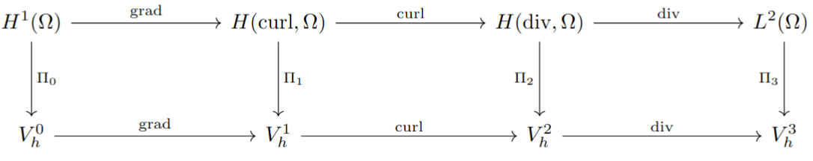
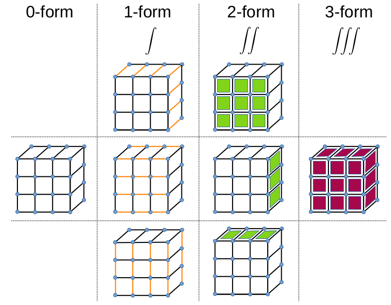
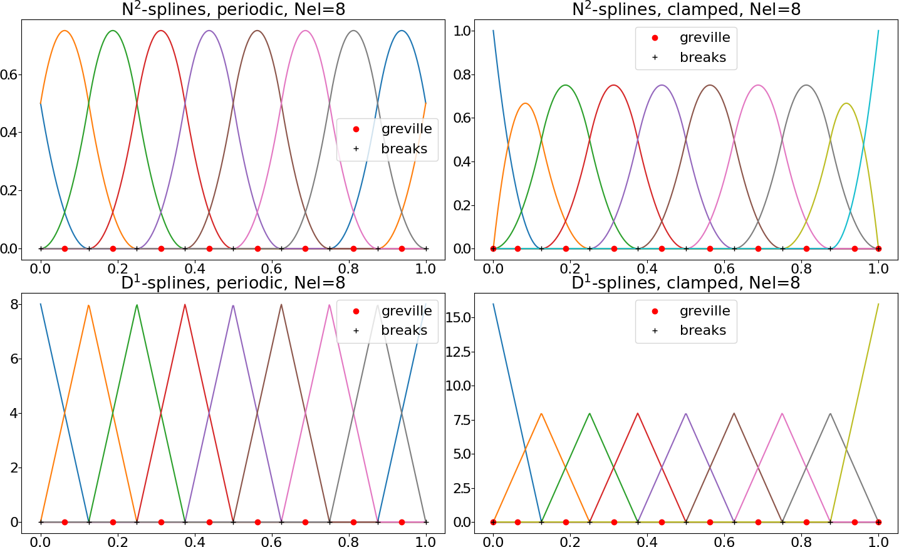
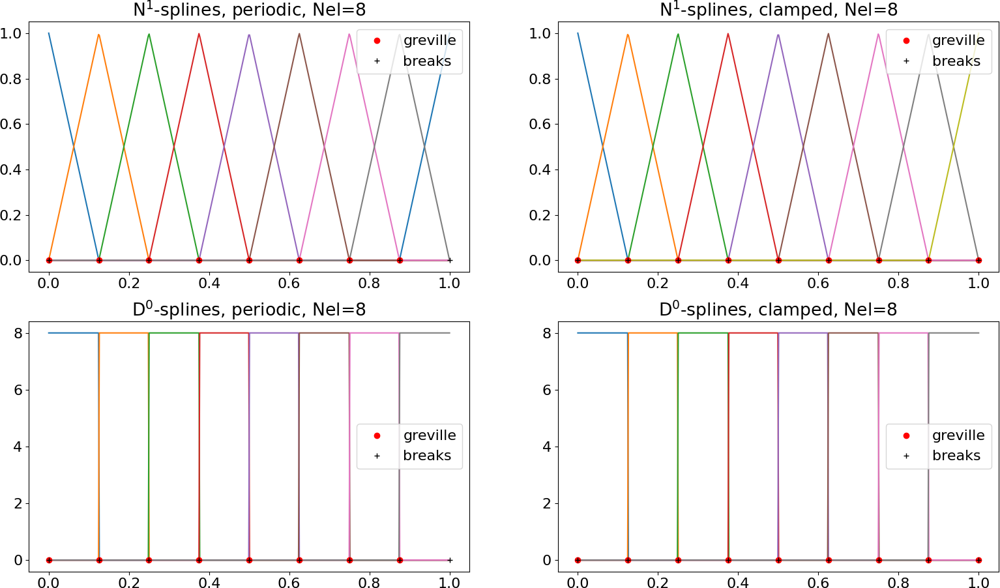
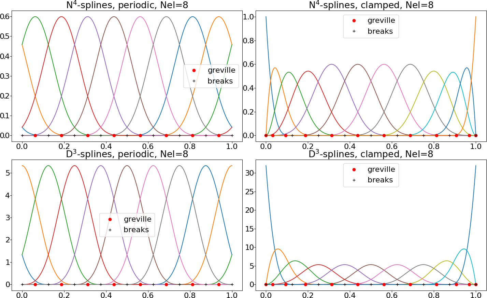
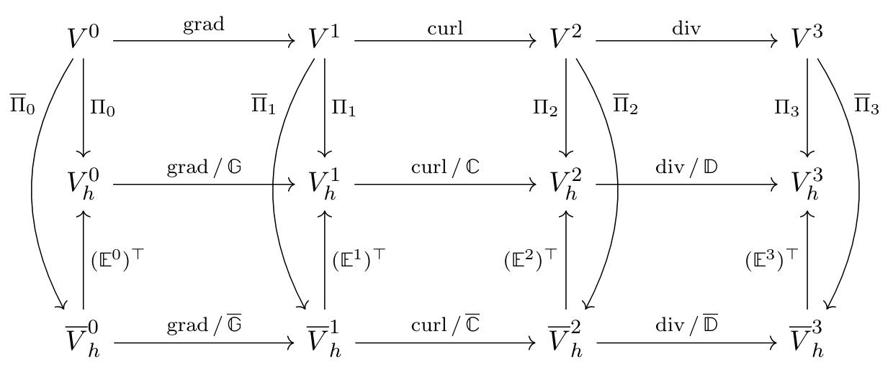

.. _geomFE:

Geometric finite elements (FEEC)
--------------------------------

.. _feec_basics:

Basics
^^^^^^

In **conforming finite element (FE) methods**, the general principle of approximating a function :math:`u \in V` in a space :math:`V` is

.. math::

    u \approx u_h = \sum_{i=1}^{M} u_i \Lambda_i \quad \in V_h\,,

where :math:`\Lambda_i \in V` are linearly independent basis functions, :math:`(u_i)_i \in \mathbb R^M` are called coefficients
and :math:`M \in \mathbb N` is the dimension of the subspace :math:`V_h \subset V` spanned by the basis functions.
The thing the differentiates FE methods from spectral methods is the fact that the :math:`\Lambda_i` have local support
around some grid point :math:`x_i`. A nice feature of FE methods is that :math:`u_h \in V`, which leads
often to an elegant analysis of the method. The implementation of a FE method consists in writing down a system of equations
for the coefficients :math:`(u_i)_i \in \mathbb R^M`, leaving the basis functions fixed.

We denote by "geometric finite elements" the FE method based on `finite element exterior calculus (FEEC) <https://en.wikipedia.org/wiki/Finite_element_exterior_calculus>`_.
In 3D, it consists of a sequence of discrete (=finite dimensional) spaces :math:`V_h^n,\,0\leq n \leq 3` that
satisfy the **3d Derham diagram**:

    Fig. 1: 3d Derham diagram.

The upper row is a sequence of continuous function spaces, where the last space :math:`L^2(\Omega)`
is the space of square-integrable functions on :math:`\Omega`. The other spaces are:

:math:`H^1(\Omega)`: functions :math:`f \in L^2(\Omega)` for which :math:`\nabla f \in (L^2(\Omega))^3` 

:math:`H(\textnormal{curl}, \Omega)`: functions :math:`\mathbf u \in (L^2(\Omega))^3` for which :math:`\nabla \times \mathbf u \in (L^2(\Omega))^3` 

:math:`H(\textnormal{div}, \Omega)`: functions :math:`\mathbf u \in (L^2(\Omega))^3` for which :math:`\nabla \cdot \mathbf u \in L^2(\Omega)` 

More information on these spaces can be found in many textbooks on FE methods, 
for instance in `Brezzi, Fortin, "Mixed and Hybrid Finite Element Methods" <https://link.springer.com/book/10.1007/978-1-4612-3172-1>`_.

Struphy uses a conforming" FE method, 

.. math::
    
    V_h^0 \subset H^1(\Omega),\qquad V_h^1 \subset H(\textnormal{curl}, \Omega),\qquad V_h^2 \subset H(\textnormal{div}, \Omega),\qquad V_h^3 \subset L^2(\Omega)

The operators :math:`\Pi_n,\,0\leq n \leq 3` project (:math:`\Pi_n^2 = \Pi_n`) into the subspaces :

.. math::
    
    \Pi_0: \, H^1(\Omega) \to V_h^0,\qquad \Pi_1:\, H(\textnormal{curl}, \Omega) \to V_h^1,\qquad \Pi_2:\, H(\textnormal{div}, \Omega) \to V_h^2,\qquad \Pi_3:\, L^2(\Omega) \to V_h^3

These spaces and the associated operators of the Derham diagram have been implemented in the open-source package
`Psydac <https://github.com/pyccel/psydac>`_.
Struphy interfaces to this library by means of the class :class:`struphy.feec.psydac_derham.Derham`.

Both the continuous and the discrete spaces form a **complex**, which means

.. math::

    \textnormal{curl}\,\textnormal{grad}  = 0\,,\qquad \textnormal{div}\,\textnormal{curl} = 0   

holds on both levels. Moreover, the above diagram can be viewed as composed of three **commuting diagrams**, namely

.. math::
    :label: commute

    \Pi_1\textnormal{grad} = \textnormal{grad}\,\Pi_0\,,\qquad \Pi_2\textnormal{curl} = \textnormal{curl}\,\Pi_1\,,\qquad \Pi_3\textnormal{div} = \textnormal{div}\,\Pi_2

In Struphy the discrete spaces :math:`V_h^n,\,0\leq n \leq 3` are spanned by tensor-product B-spline basis functions.
Building blocks are the :ref:`uni_variate_spaces` of degree :math:`p` with basis functions :math:`N^p(\eta)` and :math:`D^{p -1}(\eta)` 
defined on the unit interval :math:`\eta \in [0, 1]`. Hence, in Struphy
the simualtion domain is always the unit cube, :math:`(\eta_1,\eta_2,\eta_3) \in \Omega = [0, 1]^3`. 
The tensor-product basis functions are denoted as follows:

.. math::
    :nowrap:

    \begin{align}
    \Lambda^0_{ijk}(\eta_1,\eta_2,\eta_3) &= N_i^{p_1}(\eta_1) N_j^{p_2}(\eta_2) N_k^{p_3}(\eta_3)\,,\qquad &&\mathbf \Lambda^0 = (\Lambda^0_{ijk})_{i=1, j=1, k=1}^{n_1, n_2, n_3} \qquad \\\\
    
    \vec{\Lambda}^1_{1,ijk}(\eta_1,\eta_2,\eta_3) &= \begin{pmatrix} D_i^{p_1 - 1}(\eta_1) N_j^{p_2}(\eta_2) N_k^{p_3}(\eta_3) \\ 0 \\ 0 \end{pmatrix}\,,\qquad &&\vec{\mathbf \Lambda}^1_1 = (\vec \Lambda^1_{1,ijk})_{i=1, j=1, k=1}^{d_1, n_2, n_3} \\\\

    \vec{\Lambda}^1_{2,ijk}(\eta_1,\eta_2,\eta_3) &= \begin{pmatrix} 0 \\ N_i^{p_1}(\eta_1) D_j^{p_2 - 1}(\eta_2) N_k^{p_3}(\eta_3) \\ 0 \end{pmatrix}\,,\qquad &&\vec{\mathbf \Lambda}^1_2 = (\vec \Lambda^1_{2,ijk})_{i=1, j=1, k=1}^{n_1, d_2, n_3} \\\\

    \vec{\Lambda}^1_{3,ijk}(\eta_1,\eta_2,\eta_3) &= \begin{pmatrix} 0 \\ 0 \\ N_i^{p_1}(\eta_1) N_j^{p_2}(\eta_2) D_k^{p_3 - 1}(\eta_3) \end{pmatrix}\,,\qquad &&\vec{\mathbf \Lambda}^1_3 = (\vec \Lambda^1_{3,ijk})_{i=1, j=1, k=1}^{n_1, n_2, d_3} \\\\

    \vec{\Lambda}^2_{1,ijk}(\eta_1,\eta_2,\eta_3) &= \begin{pmatrix} N_i^{p_1}(\eta_1) D_j^{p_2 - 1}(\eta_2) D_k^{p_3 - 1}(\eta_3) \\ 0 \\ 0 \end{pmatrix}\,,\qquad &&\vec{\mathbf \Lambda}^2_1 = (\vec \Lambda^2_{1,ijk})_{i=1, j=1, k=1}^{n_1, d_2, d_3} \\\\

    \vec{\Lambda}^2_{2,ijk}(\eta_1,\eta_2,\eta_3) &= \begin{pmatrix} 0 \\ D_i^{p_1 - 1}(\eta_1) N_j^{p_2}(\eta_2) D_k^{p_3 - 1}(\eta_3) \\ 0 \end{pmatrix}\,,\qquad &&\vec{\mathbf \Lambda}^2_2 = (\vec \Lambda^2_{2,ijk})_{i=1, j=1, k=1}^{d_1, n_2, d_3} \\\\

    \vec{\Lambda}^2_{3,ijk}(\eta_1,\eta_2,\eta_3) &= \begin{pmatrix} 0 \\ 0 \\ D_i^{p_1 - 1}(\eta_1) D_j^{p_2 - 1}(\eta_2) N_k^{p_3}(\eta_3) \end{pmatrix}\,,\qquad &&\vec{\mathbf \Lambda}^2_3 = (\vec \Lambda^2_{3,ijk})_{i=1, j=1, k=1}^{d_1, d_2, n_3} \\\\

    \Lambda^3_{ijk}(\eta_1,\eta_2,\eta_3) &= D_i^{p_1 - 1}(\eta_1) D_j^{p_2 - 1}(\eta_2) D_k^{p_3 - 1}(\eta_3)\,,\qquad &&\mathbf \Lambda^3 = (\Lambda^3_{ijk})_{i=1, j=1, k=1}^{d_1, d_2, d_3} \qquad
    \end{align}

Elements of the discrete spaces are linear combinations of the respective basis functions:

.. math::
    :nowrap:

    \begin{align}
    V_h^0 &= \textnormal{span}(\mathbf \Lambda^0)\,,\qquad p_h^0(\eta_1,\eta_2,\eta_3) = \sum_{ijk} p_{ijk}\, \Lambda^0_{ijk}(\eta_1,\eta_2,\eta_3) = \mathbf p^\top \mathbf \Lambda^0  \quad \in \,V_h^0 \\

    V_h^1 &= \textnormal{span}(\vec{\mathbf \Lambda}^1_1, \vec{\mathbf \Lambda}^1_2, \vec{\mathbf \Lambda}^1_3)\,, \\
    
    &\qquad\qquad \mathbf E_h^1(\eta_1,\eta_2,\eta_3) = \sum_{\mu=1}^3 \sum_{ijk} e_{\mu, ijk}\,\vec{\Lambda}^1_{\mu, ijk}(\eta_1,\eta_2,\eta_3) = \sum_{\mu=1}^3 \mathbf e_\mu^\top \vec{\mathbf \Lambda}^1_\mu = \mathbf e^\top \vec{\mathbf \Lambda}^1 \quad \in \,V_h^1 \\

    V_h^2 &= \textnormal{span}(\vec{\mathbf \Lambda}^2_1, \vec{\mathbf \Lambda}^2_2, \vec{\mathbf \Lambda}^2_3)\,, \\
    &\qquad \qquad \mathbf B_h^2(\eta_1,\eta_2,\eta_3) = \sum_{\mu=1}^3 \sum_{ijk} b_{\mu, ijk}\,\vec{\Lambda}^2_{\mu, ijk}(\eta_1,\eta_2,\eta_3) = \sum_{\mu=1}^3 \mathbf b_\mu^\top \vec{\mathbf \Lambda}^2_\mu = \mathbf b^\top \vec{\mathbf \Lambda}^2 \quad \in \,V_h^2 \\ 

    V_h^3 &= \textnormal{span}(\mathbf \Lambda^3)\,,\qquad n_h^3(\eta_1,\eta_2,\eta_3) = \sum_{ijk}^{\phantom{3}} n_{ijk}\, \Lambda^3_{ijk}(\eta_1,\eta_2,\eta_3) = \mathbf n^\top \mathbf \Lambda^3  \quad \in \,V_h^3
    \end{align}

The discrete spline functions are represented by their **FE coefficients** :math:`\mathbf p \in \mathbb R^{N_0}`, 
:math:`\mathbf e \in \mathbb R^{N_1}`, :math:`\mathbf b \in \mathbb R^{N_2}` and :math:`\mathbf n \in \mathbb R^{N_3}`.
The class for callable spline functions in Struphy is :class:`struphy.feec.derham.SplineFuntion`.
In particular, each :class:`~struphy.feec.derham.SplineFuntion` object has 

1. the property ``vector`` holding the FE coefficients, along with a setter method,

2. a ``__call__()`` method for evaluating the spline at (an array of) points :math:`(\eta_{ijk})_{ijk}`.
 
A splien function can be created via the factory function ``struphy.feec.derham.Derham.create_spline_function()``. 
The space dimensions are products of the uni-variate dimensions:

.. math::
    :nowrap:

    \begin{align}
    \textnormal{dim} V_h^0 &= N_0 = n_1 n_2 n_3 \\\\
    
    \textnormal{dim} V_h^1 &= N_1 = d_1 n_2 n_3 + n_1 d_2 n_3 + n_1 n_2 d_3 \\\\

    \textnormal{dim} V_h^2 &= N_2 = n_1 d_2 d_3 + d_1 n_2 d_3 + d_1 d_2 n_3 \\\\

    \textnormal{dim} V_h^3 &= N_3 = d_1 d_2 d_3
    \end{align}

The derivatives act as follows on the FE coefficients:

.. math::
    :nowrap:

    \begin{align}
    \textnormal{grad}\, p_h^0 &= (\mathbb G \mathbf p)^\top \vec{\mathbf \Lambda}^1 \quad \in \,V_h^1 \\\\

    \textnormal{curl}\, \mathbf E_h^1 &= (\mathbb C \mathbf e)^\top \vec{\mathbf \Lambda}^2 \quad \in \,V_h^2 \\\\

    \textnormal{div}\, \mathbf B_h^2 &= (\mathbb D \mathbf b)^\top \mathbf \Lambda^3 \quad \in \,V_h^3
    \end{align}

Here, we introduced the discrete linear operators :math:`\mathbb G: \mathbb R^{N_0} \to \mathbb R^{N_1}`,
:math:`\mathbb C: \mathbb R^{N_1} \to \mathbb R^{N_2}` and :math:`\mathbb D: \mathbb R^{N_2} \to \mathbb R^{N_3}`,
which satisfy the complex property

.. math::

    \mathbb C\, \mathbb G = 0\,,\qquad \mathbb D\, \mathbb C = 0

.. note::

    A struphy userguide for the operators :math:`\mathbb G`, :math:`\mathbb C` and :math:`\mathbb D` and for the projection
    operators :math:`\Pi_n` is given in the `Tutorials <https://mybinder.org/v2/gh/struphy-hub/struphy-tutorials/main>`_.

The projectors :math:`\Pi_n,\, 0\leq n \leq 3` into the discrete spaces :math:`V_h^n,\, 0\leq n \leq 3` are constructed 
such that the commuting relations :math:numref:`commute` hold. They are defined by **Degrees of freedom (DOFs)** 
:math:`\sigma^n,\, 0\leq n \leq 3` which are functionals that map continuous functions to real numbers.
The number of DOFs for each space is equal to its dimension. A common DOF is the evaluation of a function 
at a certain point in :math:`\Omega`; if we choose :math:`N_0` such distinct points and call the corresponding
DOFs :math:`(\sigma^0_{ijk})_{i=1,j=1, k=1}^{n_1,n_2,n_3}`, we can define a projector :math:`\Pi_0:H^1 \to V_h^0` by

.. math::
    :label: dofs

    \sigma^0_{ijk}(p_h^0) = \sigma^0_{ijk}(p^0)\,,\qquad p^0 \in H^1 \mapsto p_h^0 \in V_h^0

These are :math:`N_0` equations for the coefficients :math:`\mathbf p \in \mathbb R^{N_0}` of :math:`p_h^0 \in V_h^0`.
The above formula is nothing else than classical interpolation and is used for the :math:`\Pi_0`-projector in Struphy.
The other projectors are a mix of interpolation and "histopolation" (integration between two interpolation points),
as depicted in Fig. 2. For instance, to project into the space :math:`V_h^1` (1-form), the first component is "histopolated"
in :math:`\eta_1`-direction (orange lines) and interpolated in :math:`(\eta_2, \eta_3)` (blue points);
the second component is "histopolated"
in :math:`\eta_2`-direction and interpolated in :math:`(\eta_1, \eta_3)`;
the third component is "histopolated"
in :math:`\eta_3`-direction and interpolated in :math:`(\eta_1, \eta_2)`.
The DOFs for :math:`V_h^2` contain histopolation over surface elements (green) 
and for :math:`V_h^3` one has 3d histopolation over volume elements (violet). 
This ultimately leads to the commuting property.

    Fig. 2: Degrees of freedom (DOFs) of the commuting projectors.

.. _uni_variate_spaces:

Uni-variate spline spaces
^^^^^^^^^^^^^^^^^^^^^^^^^

Finite element spaces in Struphy are based on uni-variate B-spline spaces on the interval :math:`\eta \in [0, 1]`,
as introduced for instance in Section 2.2 of 
`Hughes, Cottrell, Bazilevs, "Isogeometric analysis: CAD, finite elements, NURBS, exact geometry and mesh refinement", Comput. Methods
Appl. Mech. Engrg. 194 (2005) <https://www.sciencedirect.com/science/article/pii/S0045782504005171>`_.
B-spline basis functions of degree :math:`p` are denoted by :math:`N_i^p(\eta)` (thus also called **N-splines** in the following). 
They are **piece-wise polynomials** with a regularity of at most :math:`p-1` (they are piece-wise constants for :math:`p=0`).
Linear combinations af these basis functions give a **spline function**

.. math::

    f_h(\eta) = \sum_{i=0}^{n-1} f_i N^p_i(\eta)\,,\qquad f_i \in \mathbb R\,,

where the :math:`\mathbf f = (f_i)_{i=0}^{n-1} \in \mathbb R^n` are the **spline coefficients**. The dimension of the spline space is :math:`n`. In Struphy
two different boundary conditions can be chosen: **periodic** or **clamped**. For the latter,
the first and last basis functions are "interpolatory" at :math:`\eta=0` and :math:`\eta=1`, respectively,
meaning that :math:`f_h(0) = f_0` and :math:`f_h(1) = f_{n-1}`.
Assuming that the interval :math:`[0, 1]` is split into :math:`Nel` cells (or elements), 
the dimension of the periodic space is :math:`n=Nel`, whereas the dimension of the clamped space is :math:`n=Nel + p`.
Spline basis functions of degree :math:`p=2` are potted in Fig. 3 for :math:`Nel=8` cells.

    Fig. 3: Uni-variate spline spaces of degree :math:`p=2`.

In Fig. 3 the black crosses are the **break points** (cell interfaces) and the red dots are the **Greville points**,
which are the interpolation points used to define the DOFs for the projectors in :math:numref:`dofs`.
Moreover, we encounter the so-called **D-splines** which are related to the derivatives of N-splines via

.. math::

    \frac{\partial }{\partial \eta} N_i^p = D^{p-1}_{i-1} - D^{p-1}_i

D-splines are rescaled B-splines of degree :math:`p-1`. In the clamped case the dimension :math:`d` of the D-spline space
is thus one less than that of N-splines; in this case :math:`D^{p-1}_{-1} = D^{p-1}_{n-1} = 0`, 
where :math:`n` is the dimension of the N-spline space. 

Fig. 4 shows the uni-variate spline spaces for degree :math:`p=1`. 
Note that in this case the D-Splines are piece-wise constants and a spline function is therefore generally not continuous.

    Fig. 4: Uni-variate spline spaces of degree :math:`p=1`.

Higher degree leads to higher smoothness in Struphy, where spline functions have the maximal regularity :math:`p-1`.
Moreover, the support of each basis function is the union of :math:`p+1` adjacent cells and thus increases with the degree.
This allows for high-order methods in Struphy.
See Fig. 5 for an example with :math:`p=4`.

    Fig. 4: Uni-variate spline spaces of degree :math:`p=4`.

.. _polar_splines:

Polar splines
^^^^^^^^^^^^^

Coming soon !

