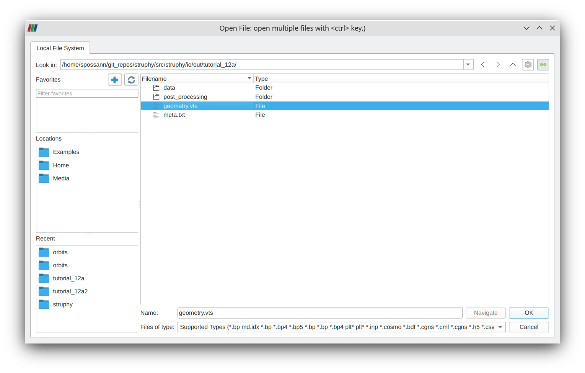
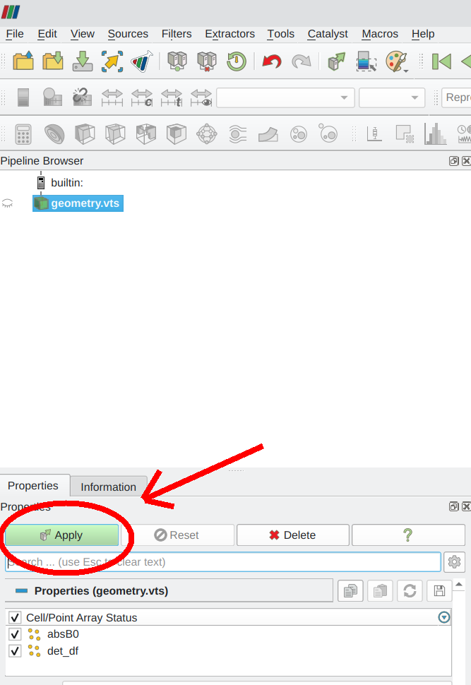
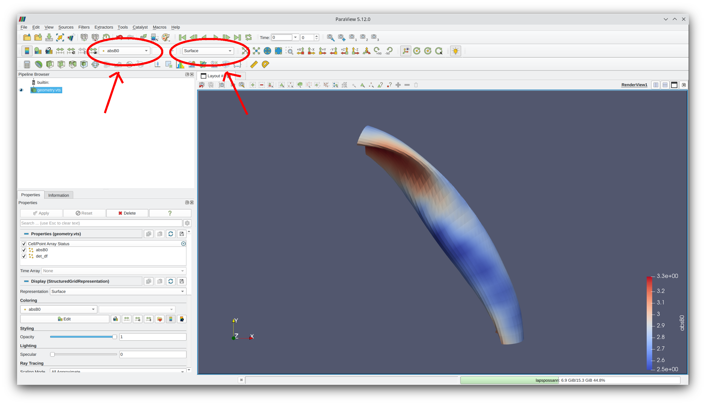
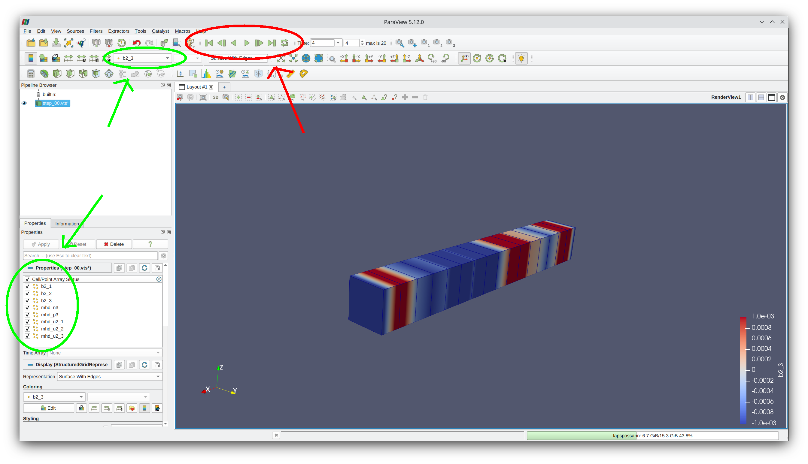
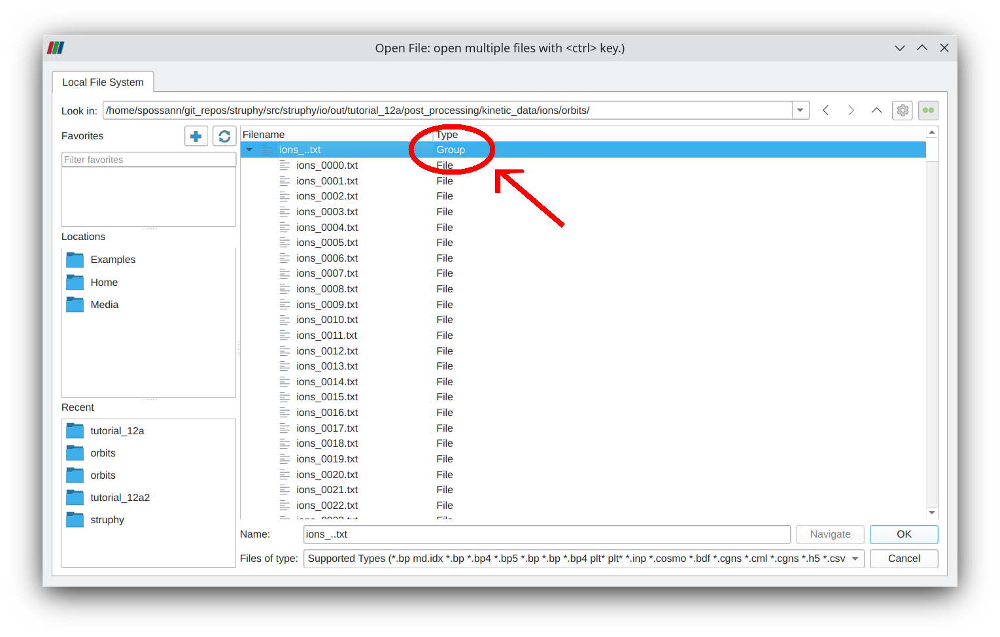
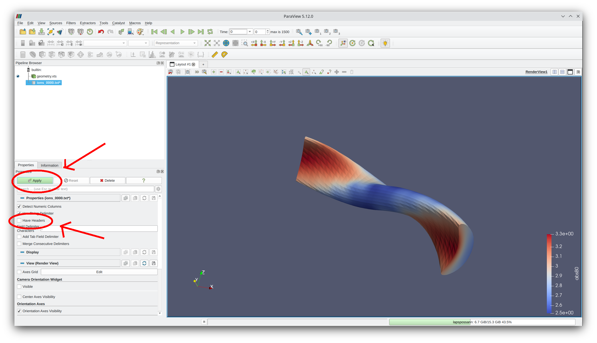
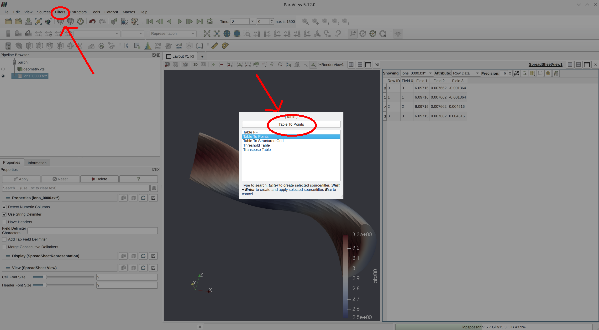
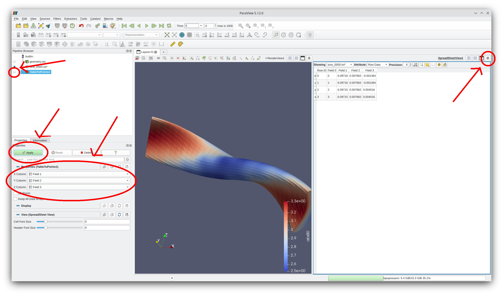
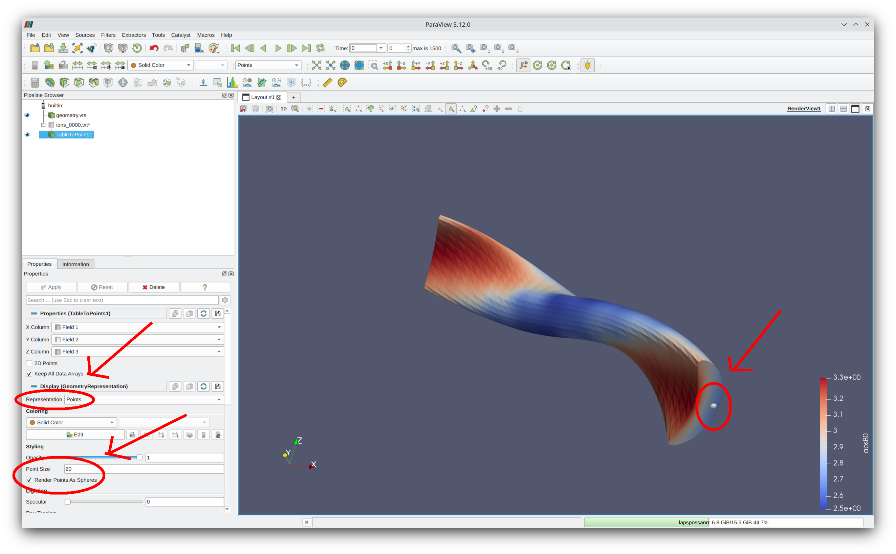

.. _paraview:

Paraview
--------

Struphy requires `Paraview 5.12 or newer <https://www.paraview.org/>`_.

The following is a brief introduction of how to load Struphy data generated from :ref:`pproc` (``.vtk/.vts files``).

Each Struphy simulation automatically saves, in ``.vts`` format, all FEEC fields as well as 

1. the Jacobian determinant of the mapped domain
2. the equilibrium magnetic field strength (if not zero) 
3. the equilibrium pressure.

The corresponding files are in ``post_processing/fields_data/vtk/`` and in ``geometry.vts`` in the simulation folder, respectively.
We shall also show how to display particle movement stored under ``post_processing/kinetic_data/<species>/orbits/``.

See `Tutorial 08 <https://struphy.pages.mpcdf.de/struphy/tutorials/tutorial_08_struphy_data_pproc.html>`_ for an overview of data generated by post processing.

Example 1: Load geometry
^^^^^^^^^^^^^^^^^^^^^^^^

In the menu ``File`` go to ``Open...``, choose the file ``geometry.vts`` in your simulation folder and click OK.

Then click the green ``Apply``-button to add the data set to the Pipeline Browser. You can toggle the eye next to the data set to (de)activate it.

In order to see for example the magnetic field strength, in the first drop-down menu (see picture below) 
choose ``absB`` and in the second drop-dowm menu choose ``Surface``, or ``Surface With Edges``.

You can now rotate the view, change the opacity or change the lightning of the object. Do not hesitate to add to this documentation
in case you discover some nice/useful tools in Paraview!

.. _load_feec:

Example 2: Load FEEC variables
^^^^^^^^^^^^^^^^^^^^^^^^^^^^^^

The loading of time-dependent FEEC variables is analogous the geometry above, 
except that the data is stored in ``post_processing/fields_data/vtk/``.
For time-dependent data, you can load the whole group at once.

Note that all FEEC variables of the model are available in one group.
You can switch between different quantities via the first drop-down menu (in green below).

You can quickly view the dynamics via the green play/stop buttons on top of the menu (bottom picture).

Example 3: Load particles
^^^^^^^^^^^^^^^^^^^^^^^^^

Particle data is saved as a ``.txt`` file under ``post_processing/kinetic_data/<species>/orbits/``; the time-dependent
particle orbits can be loaded as a group:

Before clicking ``Apply``, it is important to uncheck the box ``Have Headers`` (see below).
In the picure below, the geometry data has already been loaded.

After hitting ``Apply``, we need to add a filter via the ``Filters`` menu; using ``Search...``
we need to search for ``Table To Points`` and select it.

Now perform the following steps:

1. On the left panel set ``X Column`` to ``Field 1``, ``Y Column`` to ``Field 2`` and ``Z Column`` to ``Field 3``.
2. Hit ``Apply``.
3. Close the SpreadSheetView (showing the data table) to the right of the image view.
4. Hit the eyeball next to the TableToPoints data set in the Pipeline Browser (on the left).

Finally, in order to show the particles we need to set the ``Representation`` to ``Points``, increase the point size a bit
and check the box ``Render Points As Spheres``. This should show the particles in the plot.
Since this is time-dependent data you can use the green controls on the top of the window to
inspect the particle dynamics (as in :ref:`load_feec`).

