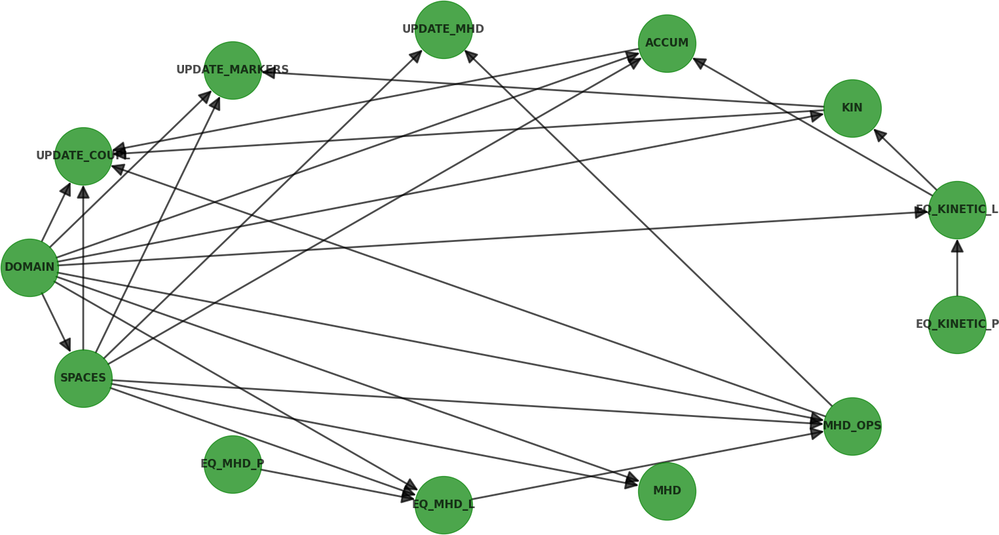

.. _userguide:

Userguide
=========

.. _intro:

Introduction
------------

:abbr:`STRUPHY (STRUcture-Preserving HYbrid codes)` is a multi-code package
focused on kinetic-fluid hybrid models in plasma physics, based on

    1. discrete differential forms (FEEC - finite element exterior calculus) for field/fluid variables,

    2. particle-in-cell (PIC) methods for kinetic equations,

    3. mapped domains :math:`F:(\eta_1, \eta_2, \eta_3) \mapsto (x, y, z)`, where :math:`\eta_i \in [0,1]` span the logical unit cube.

A main goal of :abbr:`STRUPHY (STRUcture-Preserving HYbrid codes)` is to provide **easy access,
usage and development** of plasma hybrid codes: 

    - **easy access** (and installation) is provided through the Python Packaging Index (PYPI).

    - **easy usage** comes from the command-line interface of ``struphy`` and the single point of interaction through a ``parameters.yml`` file.

    - **easy development** because of the Python language, and the use of tailored libraries like :abbr:`STRUPHY (STRUcture-Preserving HYbrid codes)` itself (FE and mpi parallel PIC), `PSYDAC <https://github.com/pyccel/psydac>`_ (mpi parallel FE) and `pyccel <https://github.com/pyccel/pyccel>`_ (Fortran kernels).

Currently availabe codes in :abbr:`STRUPHY (STRUcture-Preserving HYbrid codes)` are

========================= ========================================== ================================================== =========================
Code name                 Description                                Features                              
========================= ========================================== ================================================== =========================
``lin_mhd``               3D linear, ideal MHD equations             choose p-form for U and p                          :ref:`model equations <lin_mhd>`
``cc_lin_mhd_6d``         Current coupling, linear MHD, 6D Vlasov    OpenMp/MPI parallel particle push and accumulation :ref:`model equations <cc_lin_mhd_6d>`
========================= ========================================== ================================================== =========================

This is expected to grow over time (anybody is welcome to contribute a new model!). 
If you are interested in adding a code please go to :ref:`developers` and visit section :ref:`add_model`.

The usage of :abbr:`STRUPHY (STRUcture-Preserving HYbrid codes)` is explained in the :ref:`quickstart` guide.

.. _objects:

STRUPHY objects
---------------

:abbr:`STRUPHY (STRUcture-Preserving HYbrid codes)` is an object-oriented code, which means it relies heavily on *Python classes*. 
From the first paragraph of the `official Python documentation <https://docs.python.org/3/tutorial/classes.html>`_:

    Classes provide a means of bundling data and functionality together. 
    Creating a new class creates a new type of object, allowing new instances of that type to be made. 
    Each class instance can have attributes attached to it for maintaining its state. 
    Class instances can also have methods (defined by its class) for modifying its state.

Classes are very efficient for interchanging information. 
Instead of passing many variables and/or functions one-by-one to a function, 
these are first grouped together in an instance of a class (the "object"), and then the object is passed. 
Moreover, each instance of a class can be different, depending on the parameters passed to the class at initialization.
For example, in :abbr:`STRUPHY (STRUcture-Preserving HYbrid codes)` there is an object called ``EQ_MHD_P`` 
which holds all information about the MHD equilibirum in Cartesian space. 
This information consists of Physics parameters but also of callable functions such as the equilibirum pressure and the magnetic field.

Each code in :abbr:`STRUPHY (STRUcture-Preserving HYbrid codes)` is based on more or less the same set of Classes, 
which are listed in the following table:

============================ ============================================ ===================== ========================================== =========
Class name                   Location in ``struphy.``                     Instance name in code Description                        
============================ ============================================ ===================== ========================================== =========
Domain                       ``geometry.domain_3d``                       DOMAIN                metric coefficients, push, pull, transform :ref:`more info <mappings>`            
Tensor_spline_space          ``feec.spline_space``                        SPACES                discrete De Rham sequence and projectors   :ref:`more info <derham>`
Equilibrium_mhd_physical     ``mhd_equil.mhd_equil_physical``             EQ_MHD_P              MHD eqilibrium functions in physical space :ref:`more info <mhd_equil_p>`
Equilibrium_mhd_logical      ``mhd_equil.mhd_equil_logical``              EQ_MHD_L              MHD eqilibrium functions in logical space  :ref:`more info <mhd_equil_l>`
Initialize_mhd               ``mhd_init.mhd_init``                        MHD                   MHD variables                              :ref:`more info <mhd>` 
MHD_operators                ``feec.mhd_operators.linear``                MHD_OPS               MHD projection operators                   :ref:`more info <mhd_ops>` 
Equilibrium_kinetic_physical ``kinetic_equil.kinetic_equil_physical``     EQ_KINETIC_P          kinetic equilibirum in physical space      :ref:`more info <kinetic_equil_p>` 
Equilibrium_kinetic_logical  ``kinetic_equil.kinetic_equil_logical``      Q_KINETIC_L           kinetic equilibirum in logical space       :ref:`more info <kinetic_equil_l>` 
Initialize_markers           ``kinetic_init.kinetic_init``                KIN                   marker information                         :ref:`more info <markers>`  
Accumulation                 ``pic.<code_name>.accumulation``             ACCUM                 pic accumulation/deposition routines       :ref:`more info <accum>` 
Linear_mhd                   ``struphy.models.substeps.push_linear_mhd``  UPDATE_MHD            MHD propagators (split steps)              :ref:`more info <push_mhd>` 
Push                         ``struphy.models.substeps.push_markers``     UPDATE_MARKERS        marker propagators (split steps)           :ref:`more info <push_markers>`
<code_dependent>             ``struphy.models.substeps.push_<code_name>`` UPDATE_COUPL          coupling terms propagators (split steps)   :ref:`more info <push_coupl>` 
============================ ============================================ ===================== ========================================== =========

The dependencies between these objects is depicted in the Figure below.
We see for example that ``DOMAIN`` has no dependencies and is therefore the lowest level.
``SPACES`` depends on ``DOMAIN`` because of polar splines bases, which rely on the iso-geometroc approach (IGA). 
Moreover, ``UPDATE_COUPL`` depends on five lower-level objects.

.. _mappings:

Mapped domains
--------------

.. include:: mappings.rst

.. _derham:

Discrete De Rham complex
------------------------

.. include:: derham.rst

.. _mhd_equil:

MHD equlibirium
---------------

.. include:: mhd_equil.rst

.. _mhd:

MHD variables
-------------

.. include:: mhd.rst

.. _mhd_ops:

MHD projection operators
------------------------

.. include:: mhd_ops.rst

.. _kinetic_equil:

Kinetic equlibirium
-------------------

.. include:: kinetic_equil.rst

.. _markers:

Markers
-------

.. include:: markers.rst

.. _accum:

Particle accumulation
---------------------

.. include:: accum.rst

.. _time:

Time stepping
-------------

.. include:: time.rst

