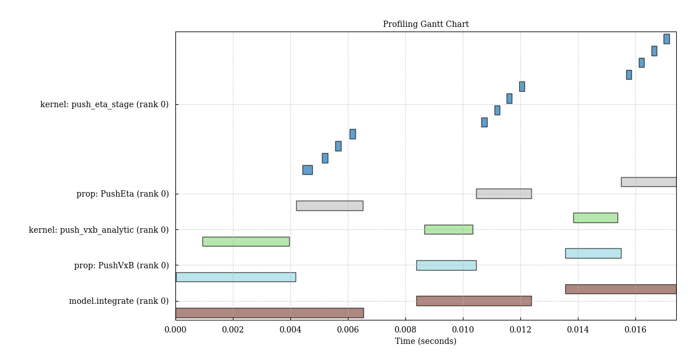
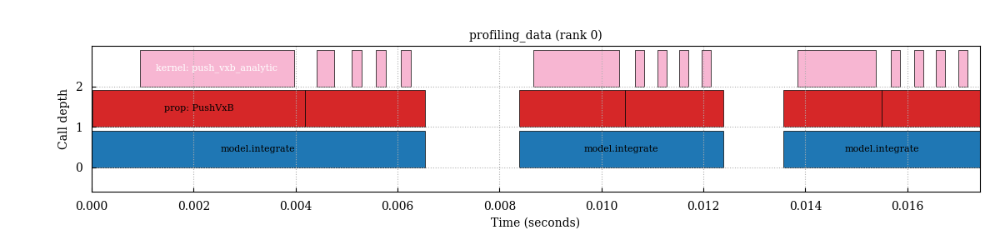

.. _userguide:

Userguide
=========

This guide is a practical, detailed companion to :ref:`quickstart`.
It focuses on common workflows in Struphy with copy-paste Python snippets
that you can adapt to your own cases.

For interactive notebooks and longer tutorial stories, see the :ref:`tutorial collection <tutorials>`.

.. highlight:: python

1. Overview
-----------

Struphy workflows are built around three concepts:

1. :class:`~struphy.Simulation`:
   The top-level runtime object. It owns global run setup (time stepping,
   geometry, grids, output folders, logging, MPI setup) and executes
   ``run()``.
2. :class:`~struphy.models.base.StruphyModel`:
   The PDE model definition. A model contains species, variables, and
   a collection of propagators used to evolve the unknowns.
3. :class:`~struphy.propagators.base.Propagator`:
   The elementary time-advancement operators. A model typically combines
   several propagators through a splitting scheme.

In practice, your script usually follows this pattern:

.. code-block:: python

    from struphy import Simulation
    from struphy.models import VlasovMaxwellOneSpecies

    model = VlasovMaxwellOneSpecies()
    sim = Simulation(model=model)
    sim.run()

For full API details, see :ref:`api_guide`.

2. Launching a simulation
-------------------------

The central entry point is :class:`~struphy.Simulation`.
For a minimal run with
:class:`~struphy.models.vlasov_maxwell_one_species.VlasovMaxwellOneSpecies`:

.. code-block:: python

    from struphy import Simulation
    from struphy.models import VlasovMaxwellOneSpecies

    model = VlasovMaxwellOneSpecies()

    sim = Simulation(
        model=model,
        params_path=__file__,
    )

    sim.run()

To print more runtime information, either set global logging level:

.. code-block:: python

    import logging
    from struphy import set_logging_level

    set_logging_level(logging.INFO)

or pass it directly when creating the simulation:

.. code-block:: python

    import logging
    from struphy import Simulation

    sim = Simulation(model=model, logging_level=logging.INFO)

Environment configuration is done with :class:`~struphy.EnvironmentOptions`.
This affects runtime behavior and output organization, not the physics:

.. code-block:: python

    from struphy import EnvironmentOptions, Simulation

    env = EnvironmentOptions(
        out_folders="./runs",
        sim_folder="vm1s_scan_A",
        restart=False,
        save_step=5,
        sort_step=20,
        max_runtime=180,
    )

    sim = Simulation(model=model, env=env)

Tip: keep one ``sim_folder`` per parameter set to make post-processing and
comparisons reproducible.

3. Choosing a model
-------------------

A model defines which PDE system is solved and which species/variables exist.
Each concrete model is a subclass of
:class:`~struphy.models.base.StruphyModel`.

Example with optional model arguments:

.. code-block:: python

    from struphy.models import VlasovAmpereOneSpecies

    model = VlasovAmpereOneSpecies(
        alpha=1.0,
        epsilon=-1.0,
        with_B0=False,
    )

Example with explicit normalization units:

.. code-block:: python

    from struphy import BaseUnits
    from struphy.models import VlasovMaxwellOneSpecies

    units = BaseUnits(x=1.0, B=1.0, n=1.0)
    model = VlasovMaxwellOneSpecies(base_units=units)

Models are collections of species. Species hold the unknowns (variables)
of your PDE system. You can inspect them directly:

.. code-block:: python

    print(model.species.keys())
    print(model.field_species.keys())
    print(model.particle_species.keys())

See :ref:`species` in the API guide for
:class:`~struphy.models.species.FieldSpecies`,
:class:`~struphy.models.species.FluidSpecies`, and
:class:`~struphy.models.species.ParticleSpecies`.

4. Choosing the geometry
------------------------

Geometry is set through the ``domain=...`` argument of
:class:`~struphy.Simulation`.
The domain defines the map from logical coordinates :math:`\eta` to physical
coordinates :math:`x`.

Simple Cartesian box:

.. code-block:: python

    from struphy import domains

    domain = domains.Cuboid(
        l1=0.0,
        r1=2.0,
        l2=0.0,
        r2=1.0,
        l3=0.0,
        r3=1.0,
    )

Curvilinear example (hollow cylinder):

.. code-block:: python

    from struphy import domains

    domain = domains.HollowCylinder(
        a1=1.0,
        a2=10.0,
        Lz=10.0,
    )

Use the :ref:`avail_mappings` page to see all available domain classes and
their parameters.

5. Space and time grids
-----------------------

Two objects control temporal and spatial resolution:

1. :class:`~struphy.Time` for time stepping.
2. :class:`~struphy.grids.TensorProductGrid` for spatial mesh resolution.

Small "smoke test" run:

.. code-block:: python

    from struphy import Time, grids

    time_opts = Time(dt=0.01, Tend=0.05, split_algo="LieTrotter")
    grid = grids.TensorProductGrid(num_elements=(16, 16, 1))

Larger production-style setup:

.. code-block:: python

    from struphy import Time, grids

    time_opts = Time(dt=0.002, Tend=10.0, split_algo="Strang")
    grid = grids.TensorProductGrid(
        num_elements=(64, 128, 16),
        mpi_dims_mask=(True, True, False),
    )

In general:

1. decrease ``dt`` until your diagnostics are stable,
2. increase ``num_elements`` until spatial convergence is acceptable,
3. activate decomposition only in directions with enough elements per rank.

6. de Rham sequence
-------------------

Discrete FEEC spaces are configured with :class:`~struphy.DerhamOptions`.
Important arguments:

1. ``degree=(p1, p2, p3)``: spline degree in each logical direction.
2. ``bcs=(..., ..., ...)``: boundary conditions per direction.
   Use ``None`` for periodic directions.
3. ``nquads`` and ``nquads_proj``: quadrature rules.
4. ``polar_splines``: special smoothness treatment near polar singularities.
5. ``local_projectors``: local commuting projectors.

Periodic setup:

.. code-block:: python

    from struphy import DerhamOptions

    derham_opts = DerhamOptions(
        degree=(3, 3, 1),
        bcs=(None, None, None),
    )

Mixed periodic/non-periodic setup:

.. code-block:: python

    from struphy import DerhamOptions

    derham_opts = DerhamOptions(
        degree=(4, 3, 2),
        bcs=(
            ("dirichlet", "free"),
            None,
            ("free", "free"),
        ),
        nquads=(6, 6, 6),
        nquads_proj=(8, 8, 8),
        polar_splines=False,
        local_projectors=True,
    )

See :ref:`api_guide` for the class reference and :ref:`geomFE` for the FEEC
background and geometric interpretation.

7. MHD equilibrium
------------------

For MHD-type setups, choose an equilibrium object and pass it via
``equil=...`` into :class:`~struphy.Simulation`.

Homogeneous slab equilibrium:

.. code-block:: python

    from struphy import Simulation, equils

    equil = equils.HomogenSlab(B0z=1.0, beta=0.05, n0=1.0)
    sim = Simulation(model=model, domain=domain, grid=grid, equil=equil)

Sheared slab equilibrium:

.. code-block:: python

    from struphy import equils

    equil = equils.ShearedSlab(
        a=1.0,
        R0=3.0,
        B0=1.0,
        q0=1.05,
        q1=1.80,
        beta=0.1,
    )

You can also use axisymmetric/toroidal equilibria such as
``EQDSKequilibrium``, ``GVECequilibrium``, and ``DESCequilibrium`` when
appropriate for your domain and model.

For the complete list and options, see :ref:`equils_avail`.

8. Choosing particle parameters
-------------------------------

Particle species are configured through
:meth:`~struphy.models.species.ParticleSpecies.set_markers`.
This method collects all marker-related setup in one place:

1. marker loading,
2. weight handling,
3. boundary behavior,
4. sorting,
5. particle diagnostics output,
6. marker-array buffer size.

Detailed setup example:

.. code-block:: python

    from struphy import (
        BinningPlot,
        BoundaryParameters,
        KernelDensityPlot,
        LoadingParameters,
        SavingParameters,
        SortingParameters,
        WeightsParameters,
    )

    loading_params = LoadingParameters(
        Np=100000,
        loading="sobol_standard",
    )

    weights_params = WeightsParameters(
        control_variate=True,
    )

    boundary_params = BoundaryParameters()

    sorting_params = SortingParameters(
        do_sort=True,
        sorting_frequency=10,
        boxes_per_dim=(24, 24, 1),
    )

    phase_plot = BinningPlot(
        slice="e1_v1",
        n_bins=(128, 128),
        ranges=((0.0, 1.0), (-8.0, 8.0)),
    )

    kde_plot = KernelDensityPlot(
        pts_e1=128,
        pts_e2=128,
        pts_e3=1,
    )

    saving_params = SavingParameters(
        n_markers=0.01,
        binning_plots=(phase_plot,),
        kernel_density_plots=(kde_plot,),
    )

    model.kinetic_ions.set_markers(
        loading_params=loading_params,
        weights_params=weights_params,
        boundary_params=boundary_params,
        sorting_params=sorting_params,
        saving_params=saving_params,
        bufsize=0.4,
    )

Practical notes:

1. start with moderate ``Np`` and increase only after diagnostics look right,
2. ``do_sort=True`` is often beneficial for large runs,
3. ``bufsize`` trades memory for safer marker-array headroom.

See :ref:`api_guide` for all marker parameter classes.

9. Setting propagator options
-----------------------------

Each model provides a model-specific propagator collection under
``model.propagators``.
You configure each propagator through its own ``Options`` dataclass.

Default options:

.. code-block:: python

    model.propagators.maxwell.options = model.propagators.maxwell.Options()
    model.propagators.push_eta.options = model.propagators.push_eta.Options()

Options with explicit variable binding:

.. code-block:: python

    model.propagators.push_vxb.options = model.propagators.push_vxb.Options(
        b2_var=model.em_fields.b_field,
    )

Coupling/initial operators (if present in your model):

.. code-block:: python

    model.propagators.coupling_va.options = model.propagators.coupling_va.Options()
    model.initial_poisson.options = model.initial_poisson.Options()

To discover available propagators for a model, inspect:

.. code-block:: python

    print(model.propagators)
    print(model.prop_list)

Always use options from the same propagator object, i.e.
``model.propagators.NAME.Options(...)``.

10. Setting initial conditions
------------------------------

Initial-condition setup depends on variable type. In the API guide, see
:class:`~struphy.models.variables.FEECVariable` and
:class:`~struphy.models.variables.PICVariable`.

FEEC variables (grid-based fields)
^^^^^^^^^^^^^^^^^^^^^^^^^^^^^^^^^^^

For FEEC variables, a common workflow is:

1. optional background via :class:`~struphy.FieldsBackground`,
2. optional perturbation via :class:`~struphy.initial.base.Perturbation`.

Example:

.. code-block:: python

    from struphy import FieldsBackground, perturbations

    model.em_fields.phi.add_background(
        FieldsBackground(type="LogicalConst", values=(0.0,), variable="phi0"),
    )

    model.em_fields.phi.add_perturbation(
        perturbations.ModesCos(ls=(1,), amps=(1e-3,)),
    )

PIC variables (particle distributions)
^^^^^^^^^^^^^^^^^^^^^^^^^^^^^^^^^^^^^^

For particle variables, a background distribution is mandatory.
Without a particle background, allocation fails.

Example background and perturbed initial condition:

.. code-block:: python

    from struphy import maxwellians, perturbations

    # Mandatory background
    f0_a = maxwellians.Maxwellian3D(n=(0.5, None), u1=(2.0, None))
    f0_b = maxwellians.Maxwellian3D(n=(0.5, None), u1=(-2.0, None))
    background = f0_a + f0_b
    model.kinetic_ions.var.add_background(background)

    # Optional explicit initial condition: if omitted, initial condition = background
    pert = perturbations.ModesCos(ls=(1,), amps=(1e-3,))
    f1_a = maxwellians.Maxwellian3D(n=(0.5, pert), u1=(2.0, None))
    f1_b = maxwellians.Maxwellian3D(n=(0.5, pert), u1=(-2.0, None))
    init = f1_a + f1_b
    model.kinetic_ions.var.add_initial_condition(init)

Common pitfalls
^^^^^^^^^^^^^^^

1. Missing PIC background:
   ``model.kinetic_ions.var.add_background(...)`` must be called.
2. Inconsistent setup:
   choose ``domain``, ``grid``, and ``DerhamOptions`` jointly.
3. No output saved:
   set ``save_data=True`` on variables you want in diagnostics.

After initial conditions are set, launch the run:

.. code-block:: python

    sim.run()

11. Post-processing and visualization
-------------------------------------

After ``sim.run()`` finishes, two methods give access to simulation results:

1. ``sim.pproc()`` — reads raw HDF5 data written during the run, evaluates
   spline fields on a grid, and writes processed arrays to disk into a
   ``post_processing/`` sub-folder inside the output directory.
2. ``sim.load_plotting_data()`` — reads those processed files back into
   memory and attaches the data as attributes on ``sim``.

The typical post-processing workflow is:

.. code-block:: python

    sim.run()
    sim.pproc()
    sim.load_plotting_data()

``sim.pproc()``
^^^^^^^^^^^^^^^

``pproc`` accepts several keyword arguments that control what is evaluated
and how:

.. code-block:: python

    sim.pproc(
        step=1,              # evaluate every N-th saved time step
        celldivide=1,        # sub-divide each grid cell for smoother output
        physical=False,      # also evaluate fields in physical coordinates
        guiding_center=False,  # compute guiding-center coordinates for markers
        classify=False,      # classify particles by trapping/passing etc.
        create_vtk=True,     # write VTK files for 3D visualization
    )

All arguments are optional and default to the values shown above.
Use ``step > 1`` to skip snapshots and speed up post-processing on large runs.
Use ``physical=True`` to get field components in physical Cartesian coordinates
in addition to the default logical-coordinate evaluation.

``sim.load_plotting_data()``
^^^^^^^^^^^^^^^^^^^^^^^^^^^^^

After calling ``pproc``, ``load_plotting_data`` populates the following
attributes on the ``sim`` object:

1. ``sim.t_grid`` — 1D array of saved simulation times.
2. ``sim.grids_log`` — list of 3D arrays with logical-coordinate grid points,
   one per direction.
3. ``sim.grids_phy`` — list of 3D arrays with physical-coordinate grid points,
   one per direction.
4. ``sim.spline_values`` — evaluated FEEC field data, organized by species
   and variable name.
5. ``sim.orbits`` — particle-orbit arrays, shape ``(time, particles, attributes)``.
6. ``sim.f`` — binned distribution-function snapshots, organized by species and
   phase-space slice.
7. ``sim.n_sph`` — SPH-reconstructed density fields (for SPH-type runs).

Plotting field data
^^^^^^^^^^^^^^^^^^^^

FEEC field data is stored under ``sim.spline_values`` indexed by species and
variable name. The inner container for each variable is a dict-like object
mapping a simulation time (float key) to the evaluated array:

.. code-block:: python

    import matplotlib.pyplot as plt

    # Access the electric field log for the em_fields species
    e_log = sim.spline_values.em_fields.e_field_log

    # Plot the first component along the first direction at the last saved time
    t_last = max(e_log.data)
    e1_snapshot = e_log.data[t_last][0][:, 0, 0]  # component 0, slice along eta1
    x = sim.grids_phy[0][:, 0, 0]                 # physical x-coordinates

    plt.figure()
    plt.plot(x, e1_snapshot)
    plt.xlabel("x")
    plt.ylabel("E_1")
    plt.title(f"Electric field at t = {t_last:.3f}")
    plt.show()

For a field saved with ``save_data = True``, the variable name in
``spline_values`` follows the pattern ``<variable_name>_log``.

Plotting distribution function slices
^^^^^^^^^^^^^^^^^^^^^^^^^^^^^^^^^^^^^^

Binned particle data is stored under ``sim.f`` after ``load_plotting_data()``:

.. code-block:: python

    import matplotlib.pyplot as plt

    # Retrieve the phase-space slice defined in BinningPlot(slice='e1_v1', ...)
    slice_data = sim.f.kinetic_ions.e1_v1

    # f_binned contains the full-f distribution for each saved time step
    # delta_f_binned is the perturbation w.r.t. the background
    t_last = max(slice_data.f_binned)
    f2d = slice_data.f_binned[t_last]

    plt.figure()
    plt.imshow(f2d.T, origin="lower", aspect="auto")
    plt.xlabel("eta1 bin")
    plt.ylabel("v1 bin")
    plt.colorbar(label="f")
    plt.title(f"Phase-space distribution at t = {t_last:.3f}")
    plt.show()

Plotting particle orbits
^^^^^^^^^^^^^^^^^^^^^^^^^

If ``n_markers > 0`` was set in
:class:`~struphy.particles.parameters.SavingParameters`, individual marker
trajectories are available under ``sim.orbits``:

.. code-block:: python

    import matplotlib.pyplot as plt

    # Shape: (n_timesteps, n_saved_markers, n_attributes)
    # Column layout: [id, eta1, eta2, eta3, v1, v2, v3, weight]
    orb = sim.orbits.kinetic_ions

    plt.figure()
    plt.plot(orb[:, 0, 1], orb[:, 0, 3])  # eta1 vs eta3 for marker 0
    plt.xlabel("eta1")
    plt.ylabel("eta3")
    plt.title("Marker orbit (particle 0)")
    plt.show()

Loading data without a ``sim`` object
^^^^^^^^^^^^^^^^^^^^^^^^^^^^^^^^^^^^^^^

Post-processed data can also be loaded directly from an output folder path,
without needing to reconstruct the ``Simulation`` object:

.. code-block:: python

    from struphy.post_processing.post_processing_tools import PlottingData

    pdata = PlottingData(path_out="./runs/vm1s_scan_A/sim_1")
    pdata.load()

    # All the same attributes are available directly on pdata:
    x = pdata.grids_phy[0][:, 0, 0]
    e_log = pdata.spline_values.em_fields.e_field_log

VTK output for ParaView and PyVista
^^^^^^^^^^^^^^^^^^^^^^^^^^^^^^^^^^^^

If you call ``sim.pproc(create_vtk=True)``, Struphy writes structured-grid VTK
files (``.vts``) inside the post-processing folder, grouped by species.
Typical locations are:

1. ``<path_out>/post_processing/fields_data/<species>/vtk/*.vts``
2. ``<path_out>/post_processing/fields_data/<species>/vtk_phy/*.vts``
   (if ``physical=True`` was requested in ``pproc``)

You can discover all generated VTK files with:

.. code-block:: python

    from pathlib import Path

    path_out = Path(sim.env.path_out)
    vtk_files = sorted(path_out.glob("post_processing/fields_data/*/vtk/*.vts"))
    vtk_phy_files = sorted(path_out.glob("post_processing/fields_data/*/vtk_phy/*.vts"))

    print(f"Found {len(vtk_files)} logical VTK files")
    print(f"Found {len(vtk_phy_files)} physical VTK files")
    if vtk_files:
        print("Example:", vtk_files[0])

Open in ParaView (GUI workflow):

1. ``File -> Open`` and select one or more ``.vts`` files.
2. Click ``Apply``.
3. Use filters like ``Slice``, ``Contour``, and ``Glyph`` for field analysis.

Open in PyVista (Python workflow):

.. code-block:: python

    import pyvista as pv

    # Pick one VTK snapshot
    mesh = pv.read(str(vtk_files[0]))

    print(mesh)
    print("Available point-data arrays:", mesh.point_data.keys())

    # Replace 'array_name' with one key from mesh.point_data.keys()
    array_name = list(mesh.point_data.keys())[0]

    pl = pv.Plotter()
    pl.add_mesh(mesh, scalars=array_name, cmap="viridis")
    pl.add_axes()
    pl.show()

This VTK path is usually the fastest way to inspect full 3D structure in large
runs, while ``sim.load_plotting_data()`` is often more convenient for custom
Matplotlib analysis scripts.

.. _code_profiling:

12. Code Profiling
------------------

Struphy offers two complementary profiling paths:

1. Python :mod:`line_profiler` for line-by-line timing of selected functions.
   This is the right tool when you want to locate hotspots inside a small
   number of functions and inspect the cost of individual statements.
2. :class:`~scope_profiler.ProfileManager` for simulation-level profiling.
   This is the built-in instrumentation used by :class:`~struphy.Simulation`
   to record coarse profiling regions such as ``model.integrate`` and to
   collect time traces over a full run.

The two tools are usually used together: ``line_profiler`` helps with local
optimization, while ``ProfileManager`` shows where time is spent across the
whole simulation workflow.

line_profiler
^^^^^^^^^^^^^

The Python package `line_profiler <https://kernprof.readthedocs.io/en/latest/>`_
profiles individual lines inside decorated functions. Struphy already imports
``from line_profiler import profile`` in the relevant modules, so the functions
you want to inspect are marked with ``@profile`` in the source code.

To enable line profiling, run the script with the environment variable
``LINE_PROFILE=1`` set. The repository CI uses the same activation pattern:

.. code-block:: bash

    LINE_PROFILE=1 python test.py

When profiling is enabled, the decorated functions are recorded and the run
prints a line-by-line summary at the end. The output shows the standard
``line_profiler`` columns:

1. ``Line #``: source line number.
2. ``Hits``: number of executions.
3. ``Time``: total time spent on the line.
4. ``Per Hit``: average time per execution.
5. ``% Time``: fraction of the profiled function time.
6. ``Line Contents``: the source line itself.

For detailed inspection of a saved result, use the formatter provided by
``line_profiler``:

.. code-block:: bash

    python -m line_profiler profile_output.lprof

This prints the same tabular timing information in a readable form. If you use
the repository defaults, the profiling output is written alongside the run and
can be inspected again later from the generated ``.lprof`` and text output
files.

ProfileManager
^^^^^^^^^^^^^^

Struphy's simulation-wide profiler is configured in
:class:`~struphy.Simulation` through :class:`~scope_profiler.ProfileManager`.
The run-time switch is passed to :meth:`~struphy.Simulation.run`:

.. code-block:: python

    sim.run(profiling_activated=True)

Profiling details are configured with :class:`~struphy.ProfilingOptions` and
passed to the simulation:

.. code-block:: python

    from struphy import ProfilingOptions, Simulation

    profiling_opts = ProfilingOptions(
        file_path="profiling_data.h5",
        use_line_profiler=False,
        recursive_profile=False,
        capture_region_source=True,
    )

    sim = Simulation(model=model, profiling_opts=profiling_opts)
    sim.run(profiling_activated=True)

Useful :class:`~struphy.ProfilingOptions` fields are:

1. ``file_path``: optional output file name or path. If omitted, Struphy writes
   ``profiling_data.h5`` in the simulation output folder.
2. ``use_line_profiler``: include line-by-line timings for functions decorated
   with ``@profile``.
3. ``recursive_profile``: recursively profile decorated functions by default.
4. ``capture_region_source``: store the source location/text that defines each
   profiling region, useful for later inspection with ``scope-profiler
   inspect --source``.
5. ``buffer_limit``: initial event-buffer size per region. Buffers grow on
   demand, but increasing this can reduce reallocations for very hot regions.
6. ``use_likwid``: collect LIKWID hardware counter data when the run environment
   is set up for LIKWID.
7. ``use_nvtx``, ``use_gpu_timing`` and ``gpu_timing_backend``: add NVIDIA
   Nsight ranges and/or CUDA-event timings for GPU-oriented runs.
8. ``aggregation_mode``: store aggregate region statistics without the full
   event timeline.
9. ``output_mode``: select the MPI HDF5 writer (``"auto"``, ``"direct"`` or
   ``"parallel"``).
10. ``hdf5_compression``, ``hdf5_compression_level`` and ``hdf5_chunk_size``:
    configure compression and chunking of profiling datasets.
11. ``deactivate_file_output``: skip writing the HDF5 file when only in-memory
    results are needed.

The profiler is set up at the start of ``Simulation.run()`` and finalized when
``Simulation.run()`` finishes. The simulation code already wraps key work inside
regions via ``ProfileManager.profile_region(...)``. This means setup,
time-stepping, diagnostics and selected lower-level solver/particle operations
are recorded out of the box:

1. Setup: ``setup: allocate`` (total allocation time), with the nested regions
   ``setup: feec`` (``setup: derham``, ``setup: mass ops``, ``setup: basis ops``,
   ``setup: projected equil``), ``setup: variables`` (one
   ``setup var: <species>.<variable>`` region per model variable, so that e.g.
   marker drawing shows up per particle species), ``setup: propagators`` (one
   ``setup prop: <PropagatorName>`` region per propagator) and
   ``setup: helpers``.
2. Remaining run preparation: ``setup: run metadata``, ``setup: data storage``,
   ``setup: geometry vtk``, ``setup: plasma params``,
   ``setup: initial diagnostics``, ``setup: hdf5 datasets`` and, for restarted
   runs, ``setup: restart``.
3. Time loop: ``model.integrate``, ``diagnostics``, ``save data`` and
   ``sort particles``.

Inside ``model.integrate`` the regions nest as follows:

1. ``prop: <PropagatorName>``, one per propagator call (twice per step for the
   half steps of Strang splitting).
2. Particle pushing: ``pusher: <kernel_name>`` for a full
   :class:`~struphy.pic.pushing.pusher.Pusher` call, containing one
   ``kernel: <kernel_name>`` region per pusher, init and eval kernel call.
3. Accumulation: ``accum: <kernel_name>`` for a full
   :class:`~struphy.pic.accumulation.particles_to_grid.Accumulator` call,
   containing the ``kernel: <kernel_name>`` region of the accumulation kernel
   and ``accum comm: <kernel_name>`` for the assembly/ghost-region exchange and
   the inter-clone ``Allreduce``.
4. Particle bookkeeping and communication, recorded wherever they are called
   from: ``mpi_sort_markers``, ``apply_kinetic_bc``, ``put_particles_in_boxes``
   and ``do_sort``.
5. Linear solves: ``solve: SchurSolver``, ``solve: SchurSolverFull``,
   ``solve: SchurSolverFull3``, ``solve: SaddlePointSolver``,
   ``solve: ODEsolverFEEC`` for the shared solver classes, and
   ``solve: <PropagatorName>`` for propagators that call a
   ``feectools`` inverse operator directly.
6. ``update_feec_variables`` for writing back FEEC coefficients (includes the
   ghost-region update).

Since regions nest, the sum over all regions exceeds the wall-clock time; use
the flame graph (below) to read the containment.

Example configuration in a parameter file:

The quickest way to try this out is to generate a default parameter file for
a model. For example, with the ``Vlasov`` model:

.. code-block:: bash

    struphy params Vlasov

This writes ``params_Vlasov.py`` in the current directory. The generated file
contains:

.. code-block:: python

    profiling_opts = ProfilingOptions()

Adjust it if you need specific profiler settings:

.. code-block:: python

    profiling_opts = ProfilingOptions(
        file_path="vlasov_profile.h5",
        use_line_profiler=True,
        capture_region_source=True,
    )

Then activate profiling manually in the run call:

.. code-block:: python

    sim.run(profiling_activated=True)

or edit the generated ``if __name__ == "__main__":`` block while profiling:

.. code-block:: python

    if __name__ == "__main__":
        sim.run(profiling_activated=True)

Run the file as usual:

.. code-block:: bash

    python params_Vlasov.py

When profiling is enabled, Struphy writes the main profiling data to
``profiling_data.h5`` in the simulation output folder. The file contains the
region timings and per-call timestamps needed for time-based plots such as
Gantt charts and flame graphs.

Note that ``profiling_data.h5`` is a plain ``scope-profiler`` output file, so
it is post-processed with ``scope-profiler`` itself rather than with
``sim.pproc()`` — the two are independent post-processing paths.

Post-processing with the ``scope-profiler`` CLI
^^^^^^^^^^^^^^^^^^^^^^^^^^^^^^^^^^^^^^^^^^^^^^^^

``scope-profiler`` ships its own post-processing commands. In version 0.4.0,
plotting lives under ``scope-profiler plot``. For the full set of standard
figures, use the ``all`` preset:

.. code-block:: bash

    scope-profiler plot all sim_1/profiling_data.h5 \
        --include '^setup: total$' '^model\.integrate$' '^prop: ' '^kernel: ' \
        -o figures

The two figures below were generated exactly this way, from the
``params_Vlasov.py`` example above (default grid and time stepping,
3 saved steps, 1 MPI rank), filtered to ``setup: total``,
``model.integrate``, ``prop: <PropagatorName>`` and ``kernel: <kernel_name>``
regions. To regenerate them, run ``doc/generate_profiling_figures.sh`` from the
repository root.

The Gantt chart places one lane per ``(region, rank)`` pair and is the view to
reach for when the question is *when* things happened — startup cost, gaps
between steps, ranks drifting apart:

    Gantt chart produced by ``scope-profiler plot all`` for the ``Vlasov``
    example, one lane per region.

The flame graph instead answers *where the time went*: the call stack is
reconstructed from timestamp containment, so nested regions such as
``kernel: push_vxb_analytic`` inside ``prop: PushVxB`` inside
``model.integrate`` are drawn as stacked levels rather than separate lanes:

    Flame graph for the same run, rank 0, showing nested profiling regions.

Passing several ``profiling_data.h5`` files (e.g. from runs at different MPI
rank counts) to ``scope-profiler plot speedup`` produces a per-region speedup
plot, and ``--x`` can compare runs along other metadata fields such as
``omp_num_threads``. Filtering regions with ``--include``/``--exclude``,
selecting ranks with ``--ranks``, switching to interactive HTML output with
``--backend plotly``, inspecting text summaries with ``scope-profiler
inspect``, and exporting the underlying plot data or ``.prof`` / speedscope
files with ``scope-profiler export`` are all covered in the
`postprocessing CLI guide <https://max-models.github.io/scope-profiler/guide/postprocessing_cli.html>`_.
This documentation page is not meant to duplicate that guide — see the link
for the full set of flags and examples.

For a quick text sanity check, run ``scope-profiler inspect
sim_1/profiling_data.h5`` and compare the total runtime of the dominant regions
across ranks. A large imbalance between ranks usually means the expensive
section is load-dependent rather than purely algorithmic.

If ``use_line_profiler=True`` was set in :class:`~struphy.ProfilingOptions`, the
same HDF5 file also stores line-profiler timings. Inspect them with:

.. code-block:: bash

    scope-profiler line-profile sim_1/profiling_data.h5

For interactive terminal exploration, use:

.. code-block:: bash

    scope-profiler tui sim_1/profiling_data.h5
